<p align="center">
  
</p>

<h1 align="center">ziggity</h1>

<p align="center">
  A fast terminal UI for Git, written in Zig.
</p>

<p align="center">
  
  
  
</p>

Ziggity puts your whole Git workflow in one terminal window: stage single
lines, commit, branch, rebase interactively, and read history without ever
reaching for the mouse. Every list has a live diff preview, every action is a
keystroke, and nothing ever blocks the interface.

It follows the workflow that [lazygit](https://github.com/jesseduffield/lazygit)
made popular, and it owes that project a lot. It is not a port, though. Ziggity
is written from scratch in Zig, drives plain `git` subprocesses (no libgit2),
and in the places where the two tools differ, the difference is deliberate.
The section below explains exactly where and why.

<p align="center">
  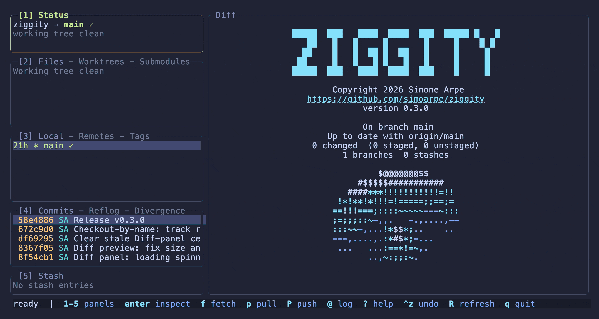
</p>

<p align="center"><i>The Status panel about splash. Yes, the donut spins.</i></p>

<p align="center">
  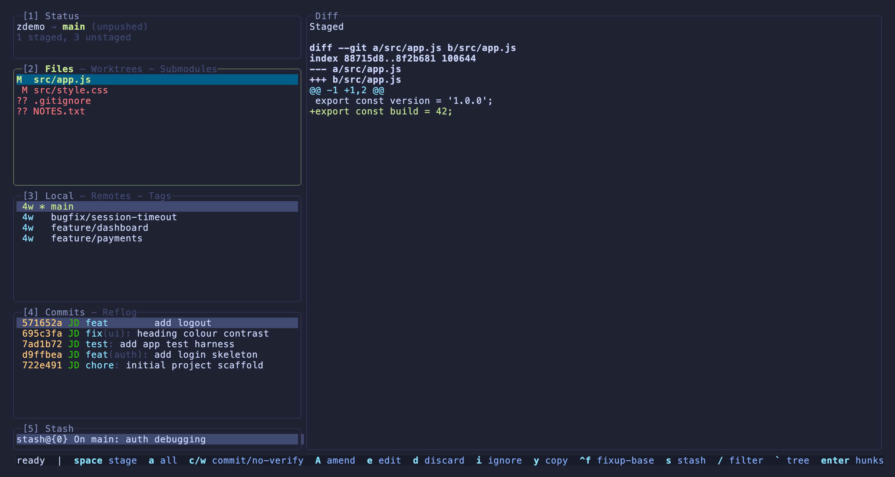
</p>

<p align="center"><i>Status, Files, Branches, Commits and Stash panels with a live diff preview and a footer that follows context.</i></p>

---

## Contents

- [Why Ziggity](#why-ziggity)
- [Installation](#installation)
- [Highlights](#highlights)
- [Screenshots](#screenshots)
- [Features](#features)
- [Keybindings](#keybindings)
- [Configuration](#configuration)
- [Status & Roadmap](#status--roadmap)
- [Development](#development)
- [Sponsor](#sponsor)
- [License](#license)

## Why Ziggity

If lazygit already works for you, great: it is an excellent tool. Ziggity
exists because a few everyday interactions could be quicker, more efficient,
or more predictable, and because Zig makes it possible to deliver that in a
tiny native binary. Here is the honest case, point by point.

### Small and Fast

Ziggity compiles to a single static binary with no runtime, no garbage
collector, and no library dependencies beyond the `git` you already have.
Measured on an Apple Silicon laptop against lazygit 0.62.2, same repository,
same terminal:

| | ziggity 0.3.0 | lazygit 0.62.2 |
|---|---|---|
| Binary size | **1.8 MB** | 17.6 MB |
| Process startup, median of 30 runs | **2.9 ms** | 19.2 ms |
| Resident memory after opening a repo | **3 MB** | 18 MB |
| Git subprocesses to load the repo | **26** | 38 |
| Peak git processes running in parallel | **11** | 9 |
| CPU time to open the repo and idle 10 s | **50 ms** | 140 ms |
| Network fetch at startup | none | `git fetch --all` |

Startup is the time from spawn to exit for `--version`, the floor any launch
pays before real work begins. Memory is resident set size a few seconds after
opening the same repository. The CPU row is the total processor time each
tool consumed while opening that repository and then sitting idle for ten
seconds, so it captures both the startup burst and the ongoing refresh cost.
The subprocess numbers come from a logging shim on `PATH` that timestamps
every git invocation, so the whole startup burst of both tools is on record.
Run the same checks yourself; numbers will vary by machine, the gap will not.

The subprocess log also shows where the efficiency comes from. When Ziggity
opens a repository it fans out eleven loaders at once, one per concern:
status, working tree files, local branches, remote branches, remotes, tags,
worktrees, submodules, the commit log, the reflog, and the stash list. The
shim caught all eleven git processes in flight at the same instant, launched
within six milliseconds of each other, and every panel had its data about 70
milliseconds later. Each loader asks git for machine readable output
(`--porcelain -z`, `--format` with null separators) and parses it in a single
pass, no shell in between, no libgit2 state to synchronize. To be fair,
lazygit parallelizes its refresh too; it just takes half again as many
subprocesses to load the same repository, spends almost three times the CPU
in the same ten seconds, and kicks off a network fetch the moment it starts,
while Ziggity defers its first quiet background fetch and never touches the
network during launch.

After launch the same discipline holds. The commit log loads incrementally as
you scroll, so history is never capped and never loaded whole. Rendered
previews are cached, so reselecting a commit is instant instead of a fresh
`git show`. Background refreshes are scoped to what an operation could have
changed, so a big repository does not get a full `git status` storm every few
seconds. And everything slow runs off the interface thread, which is the next
section.

### Nothing Blocks, Ever

Fetch, pull and push run off the interface thread. A spinner ticks in the
Status panel, you keep navigating, and when the operation finishes you get a
one line summary. Success is silent; only failures open a dialog, and each
message can be easily copied.

<p align="center">
  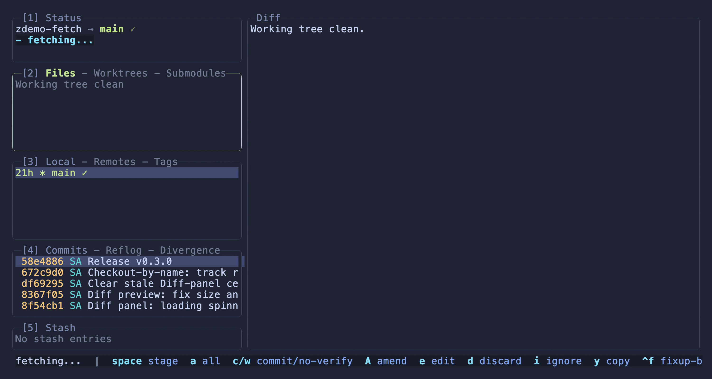
</p>

<p align="center"><i>A fetch in flight. The selection keeps moving; the spinner lives in the Status panel.</i></p>

At no point does Ziggity drop you back to the raw terminal to run git. If you
use lazygit, you know the "press enter to return to lazygit" screen it shows
after handing an operation to the terminal; Ziggity has no equivalent, because
nothing ever leaves the interface. Slow multistep actions (merge, rebase,
autosquash, bisect, patch apply) follow the same rule: they run in the
background while navigation stays live. The single intentional exception is
`e`, which opens the selected file in your default editor: a terminal editor
suspends the interface and resumes when you quit it, a GUI editor just
launches alongside.

Even authentication stays inside the app. When a push over HTTPS needs
credentials, Ziggity opens a username prompt and a masked token prompt right
there, feeds git through its normal askpass machinery, and retries. No
external helper required, no terminal takeover, and a configured keychain
still caches the result for next time. If the host rejects a password because
it wants a token, Ziggity says so instead of asking again in a loop.

<p align="center">
  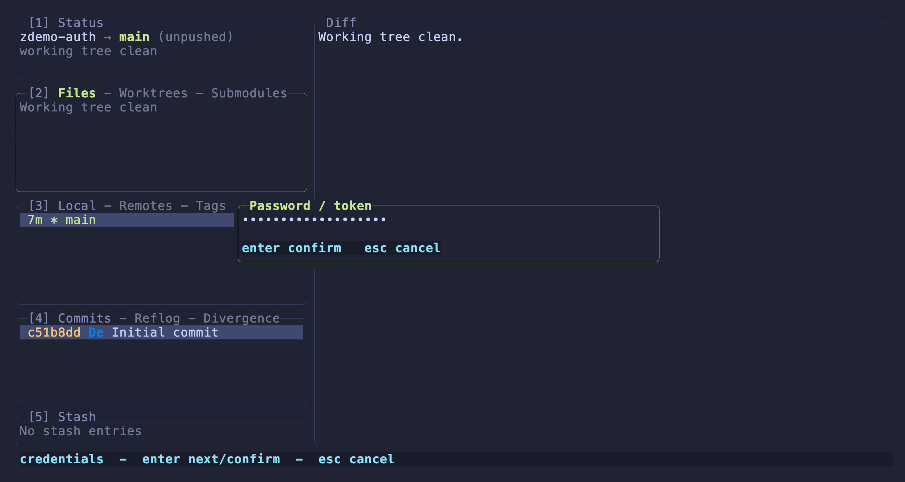
</p>

<p align="center"><i>An HTTPS remote asked for credentials. The token field masks as you type, and the fetch retries in place.</i></p>

### Copy Text Straight from the Screen

Terminal UIs usually make copying painful: the terminal's own selection grabs
the whole screen, panel borders included. Ziggity has real text selection
built in. Click and drag over the diff to select an exact span of characters;
release, and it is already on your clipboard.

- Works on whatever the main panel shows: a file diff, a commit, a branch
  log, a stash, the commit graph.
- The copied text is clean. Color codes are stripped, indentation survives,
  and multiline selections join with newlines.
- The same selection works in the read only dialogs: command output, the
  keybindings overlay, and the command log.
- Dragging does not steal focus from the panel you were in, so your place in
  the list is kept.

Copying uses OSC 52, the same mechanism as every other copy action in the
app, so it works over SSH too as long as the terminal supports it.

### The Mouse Works Everywhere

Ziggity is built for the keyboard, but the mouse is a first class citizen,
not an afterthought:

- Click any panel to focus it, click any row to select it.
- In the staging view, click a line to put the cursor on it, then stage it
  with `space`. No walking down hunk by hunk to reach one line.
- In the checkout prompt, click a suggestion to pick it.
- The wheel scrolls every list, the diff, dialogs and the commit graph, and
  the graph also supports click and drag.
- And as above, dragging over the diff or a dialog selects and copies text.

<p align="center">
  
</p>

<p align="center"><i>A live session in Ghostty, driven with the mouse: every click lands on a file or panel, the diff follows along, and the staging view opens in place.</i></p>

### At Home in Any Terminal

A tool like this lives or dies by terminal quirks, so Ziggity spends real
effort on compatibility. Colors stick to the standard ANSI palette and a
curated 256 color set, with emphasis done through dim and bold rather than
exotic indices, so the interface stays readable on a stock Terminal.app, a
Linux console, or a tricked out truecolor setup alike. Clipboard copy uses
OSC 52, so it survives SSH. Focus events pause animations and background
refreshes when the window loses focus. Bracketed paste keeps a pasted
multiline commit message from submitting early, and the kitty keyboard
protocol is used where available.

Ziggity is developed daily in [Ghostty](https://ghostty.org), where it works
fantastically. Every screenshot and gif in this README uses the TokyoNight
Moon palette from that setup, and the mouse demo above is a live recording
of it.

### Checkout by Name That Lands on a Real Branch

Type `c`, start typing any ref, pick from live suggestions, press enter. If
you name a remote branch, Ziggity checks it out with `--track`: you land on a
proper local branch with its upstream set, in one step.

<p align="center">
  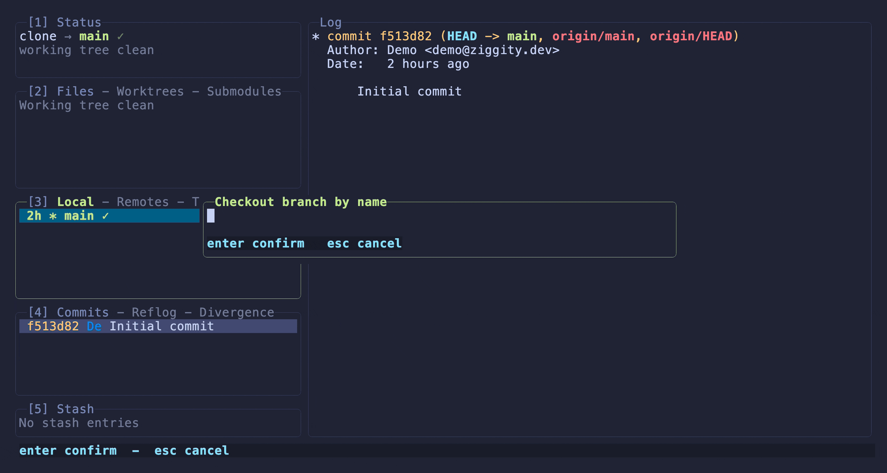
</p>

<p align="center"><i>Typing a remote branch name. One enter later: a local tracking branch, upstream set, never a detached HEAD.</i></p>

This is a spot where lazygit gets it wrong. As of today, typing a remote
branch name in its checkout prompt runs a plain checkout of that ref: you
land on the head commit in a detached state, no local branch, no tracking.
Ziggity does what you meant instead. A remote name tracks, an existing local
name switches, a tag or commit detaches because that is the only correct
meaning, and `-` returns to the previous branch.

### A Commit Editor That Nudges the 50/72 Rule

The commit dialog is a real editor with a subject line and a multiline body,
and it quietly teaches good commit hygiene. The subject shows a live
character count that turns red past 50. The body draws a soft guide column at
72 so wrapped lines have an obvious edge. Both thresholds are configurable,
including off.

<p align="center">
  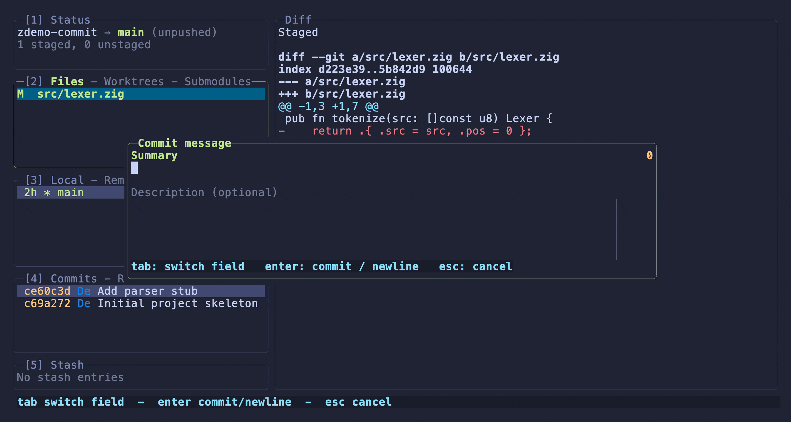
</p>

<p align="center"><i>The counter turns red as the subject passes 50 characters, and back to yellow once trimmed. The body shows its wrap guide at column 72.</i></p>

The dialog also runs your repository's `prepare-commit-msg` hook when it
opens, the way an interactive `git commit` would, and prefills the message
from its output. The common hook that derives a ticket prefix from the branch
name finally works from a TUI: those hooks usually guard on an empty source
argument, which a message flag never satisfies, so in other tools they
silently do nothing (lazygit issue
[#4995](https://github.com/jesseduffield/lazygit/issues/4995)). Drafts
survive too: close the dialog, come back later, your message is still there.

### A Force Push That Never Dead Ends

When a push is rejected because the remote moved, what happens next should
not depend on hidden state. Ziggity walks one predictable ladder, confirming
each step:

```
git push
  rejected: confirm, then git push --force-with-lease
    rejected again (stale lease): confirm, then git push --force
      still failing: report the error and stop
```

<p align="center">
  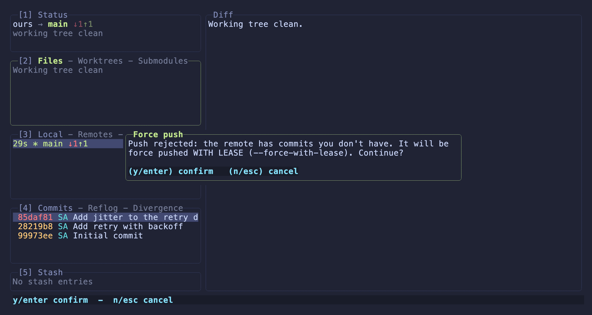
</p>

<p align="center"><i>The remote moved, the push was rejected, and the first rung of the ladder asks before running. Note the diverged arrows and the red unpushed hash.</i></p>

The safe force always comes before the blunt one, there is no "you must pull
first" dead end, and the chain never loops. Rejections are recognized from
git's own messages; unrelated failures such as authentication or network
errors surface as normal errors with no force offer. Either confirmation can
be turned into an auto accept in config, and both default to asking.

For comparison, lazygit's behavior depends on whether the remote tracking
ref happens to be stored locally: sometimes you get the lease force,
sometimes a plain force, and sometimes only advice to pull first.

### Diffs the Way Review Tools Show Them

Comparing two refs is one keystroke: press `W` on any branch or commit and it
becomes the diff base. A short note explains what just happened and how to
leave, the marked row keeps a colored diamond while you navigate, and the
Diff title tracks every move in git's own notation with the real ref names:
`main..58e4886a`, `main...feature/login`. The order around the dots is the
direction, the dot count is the mode, so the whole state is always readable
off the screen. In lazygit the same feature opens a menu first and then keeps
its state in your head: no marker on the marked ref, no indication of what is
being compared against what.

<p align="center">
  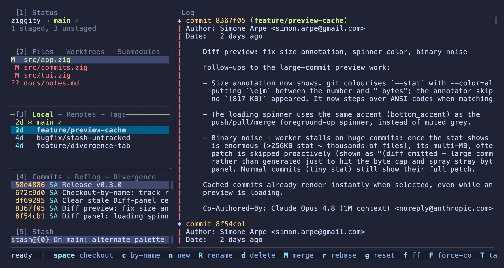
</p>

<p align="center"><i>One W marks the branch and explains itself. The diamond stays on the base; the title follows the selection with real ref names.</i></p>

The dot count matters because the two views answer different questions.
`base..selected` is the full difference between the two snapshots.
`base...selected` diffs from the merge base: only the selected side's own
changes since the histories diverged, which is what every pull request page
shows, and what you actually want after merging `master` into your branch,
when a plain two dot diff drowns you in changes that are not yours. That
merge base view was requested in lazygit as issue
[#3767](https://github.com/jesseduffield/lazygit/issues/3767) and is still
open there. Ziggity not only has it, it defaults to it whenever the marked
base is a branch, while commits and tags default to the plain two dot
comparison, because comparing snapshots is usually what those mean. Press `W`
again for the options: invert the direction, switch the dots, type an
arbitrary ref, or exit.

### Word-Level Diff Highlighting

When a line changes, Ziggity does not just paint the whole old line red and the
whole new line green and leave you to spot the difference. It compares the two
lines word by word and gives only the parts that actually changed a stronger
background, a dark red behind removed words and a dark green behind added ones,
the way delta, GitHub and VS Code do. Change `30` to `45` on a long line and
just `30` and `45` light up over the normal line color. The two-line `-`/`+`
layout stays, so nothing is lost, but your eye goes straight to what moved.
lazygit colors whole lines only. It is on by default (`highlight_word_diff`),
and the two backgrounds are themeable (`word_add_bg`, `word_del_bg`).

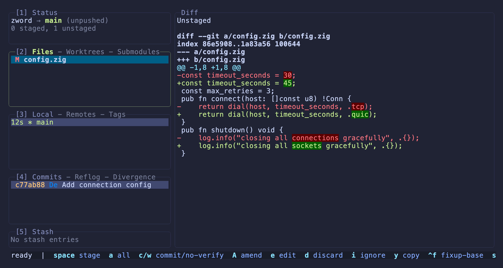

### Wrap Long Lines On Demand

Code lines are short, so by default the diff panels truncate anything past the
right edge and `H`/`L` pan across it. Prose is the opposite: a markdown or
documentation paragraph is one very long line, and the word that changed can sit
off screen, invisible, until you scroll sideways to hunt for it. Press `ctrl+w`
and every diff panel soft-wraps to the view width instead, so the whole
paragraph, and the change inside it, is right there. The word-level highlight
travels onto the wrapped rows, correctly aligned through wide characters, emoji
and tabs. Wrapping is session-wide and toggles instantly; it starts off and can
default on with `wrap_diff = true`. While it is on the Diff panel title shows a
`↩ wrap` marker, so the current state is always visible.

<p align="center">
  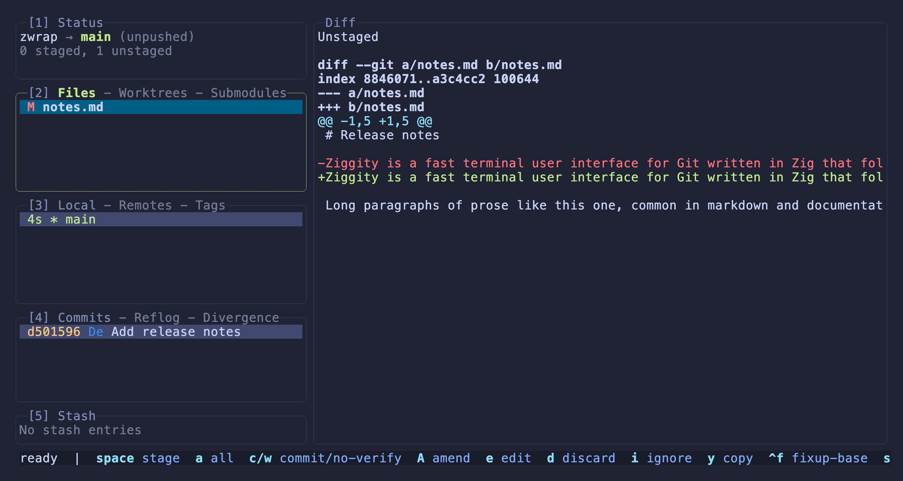
</p>

<p align="center"><i>The same prose diff, truncated then wrapped with ctrl+w. The changed word was off screen; now it is not, and it keeps its highlight.</i></p>

This is the one place lazygit and Ziggity agree it matters: lazygit wraps its
staging view by default for exactly this reason. Ziggity extends it to every
diff panel (preview, staging, fullscreen) behind one toggle.

### History Navigation with Intent

The commit graph (`ctrl+l`) is the real `git log --graph`, in git's own
colors, loaded off the interface thread. By default it shows your branch and
its upstream, so incoming commits are visible immediately; `a` widens to all
branches. `@` jumps to HEAD. And `p` jumps to the current commit's first
parent, which turns a merge heavy history into something you can walk
mainline first (requested in lazygit as
[#3974](https://github.com/jesseduffield/lazygit/issues/3974)). The parent
map is loaded alongside the graph, so the jump is a pure memory lookup.

<p align="center">
  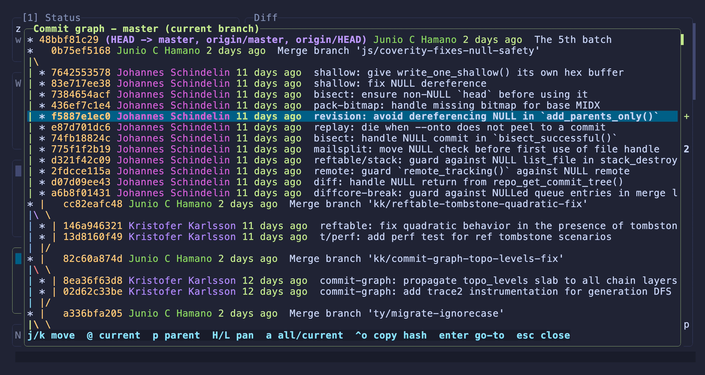
</p>

<p align="center"><i>A merge heavy history (git's own repository): parallel lanes, merges, and per author colors, exactly as git draws them.</i></p>

The Commits panel adds a Divergence tab: your branch versus its upstream,
outgoing commits grouped above incoming ones, with history editing keys
disabled there so you cannot accidentally rebase what you have not pulled.
Commit hashes are tinted by push state everywhere, red for commits that have
not left your machine, so "safe to rewrite" is visible at a glance.

### Two Histories Side by Side

The Branches panel drills into any branch's commits, and those commits'
files, independently of the Commits panel. Both keep their own selection at
the same time, so you can hold your place in the main log while you inspect
a colleague's branch. In lazygit the commit view is one shared panel tied to
the checked out branch, so inspecting another branch means losing your spot.
Diffing mode understands the drill too: the marked ref is the commit you are
actually on, not the branch that contains it.

### Jump Between Repositories

`ctrl+r` opens the recent repositories switcher: a list of every repo you have
opened in ziggity, most recent first, each row aligned as name, current branch,
and path. Pick one with `enter` and ziggity re-roots in place, no restart and
no second process. The list lives in a plain text file under the XDG state
directory (`~/.local/state/ziggity/recent`), one path per line, safe to read or
edit by hand.

Navigate with `j` and `k` or the mouse wheel, and pan long paths left and right
with `H` and `L`. Click a row to highlight it, or drag to select and copy text;
switching always happens on `enter`. If a listed repo has since been moved or
deleted, picking it asks whether to drop it from the list (nothing on disk is
touched). Remove the highlighted entry at any time with `d`; removing the last
one just closes the switcher.

<p align="center">
  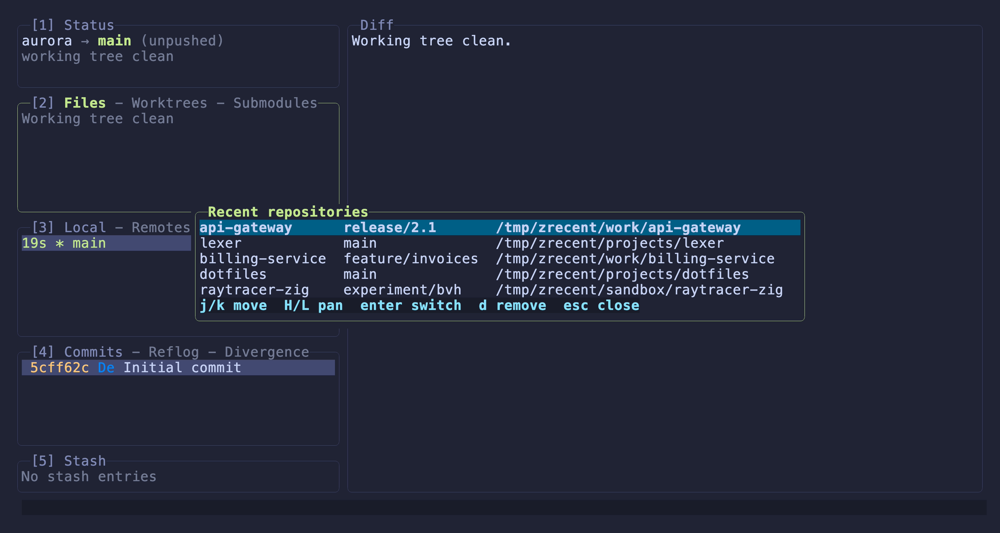
</p>

<p align="center"><i>ctrl+r lists the repos you have opened, aligned as name, branch and path. Enter switches in place; the current repo is left out.</i></p>

### Stash Without Losing Your Working Tree

The stash menu has the variant that other tools skip: snapshot everything
into a stash entry, untracked files included, while your working tree stays
exactly as it is. Nothing disappears from your editor, no half staged state
gets shuffled, and the snapshot sits in the stash list as a restore point.
It is the cheapest insurance there is before a risky refactor, and it doubles
as a way to hand a work in progress to someone else (`w` exports any stash as
a `git apply` ready patch) without interrupting your own flow.

<p align="center">
  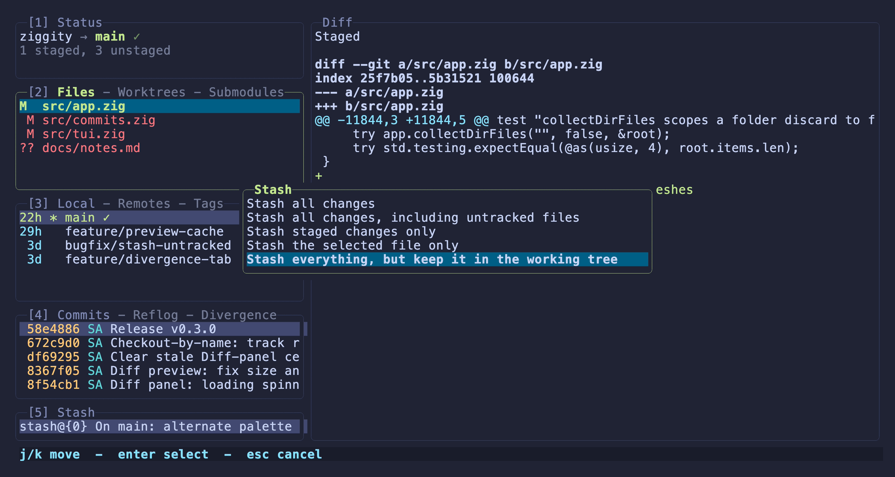
</p>

<p align="center"><i>The stash menu over a tree with staged, unstaged and untracked changes. The highlighted variant records all of it and touches none of it.</i></p>

Getting this right takes more than a flag. Git's own plumbing for it,
`git stash create`, silently ignores untracked files, so a naive
implementation records less than it claims. Ziggity stashes everything with
`--include-untracked` and immediately reapplies it with `--index`, so the
stash entry is complete and the working tree, including the staged and
unstaged split, comes back byte for byte.

### Small Courtesies

- One remote means no remote menu: pushing a tag in a single remote
  repository just pushes it. The prompt only appears when there is a real
  choice, prefilled with the suggestion.
- The stash menu covers the rest of the real cases too: everything,
  everything plus untracked, staged only, or a single file, each with an
  optional name.
- Commit subjects highlight
  [Conventional Commits](https://www.conventionalcommits.org/) prefixes: the
  type in accent, the scope muted, a breaking `!` in red
  (`highlight_conventional_commits`). And in the rebase plan editor every row
  carries its pending action label (pick, drop, squash, fixup, edit), so a
  plan reads at a glance before it runs.
- A commit that imports half a toolchain (thousands of files, gigabytes of
  binaries) previews instantly: the message and file list always load, and
  the unreadable patch is omitted instead of freezing the panel.
- Mistyped an HTTPS password? The error tells you the host wants a token
  instead of silently reprompting forever.
- `ctrl+z` undoes the last operation through the reflog, after confirmation.
  Undoing a commit or an amend brings the changes back staged rather than
  discarding them; other operations restore their prior state.

Everything above is also collected in
[`docs/ENHANCEMENTS_OVER_LAZYGIT.md`](docs/ENHANCEMENTS_OVER_LAZYGIT.md),
which tracks the same list in short form.

## Installation

Ziggity needs the `git` command on your `PATH` at runtime, since it drives
git as a subprocess. Install via Homebrew, grab a prebuilt binary, or build
from source.

### Homebrew (macOS / Linux)

```sh
brew install simoarpe/ziggity/ziggity
```

That taps [`simoarpe/homebrew-ziggity`](https://github.com/simoarpe/homebrew-ziggity)
and installs the binary, the short form of:

```sh
brew tap simoarpe/ziggity
brew install ziggity
```

Upgrade with `brew upgrade ziggity`. Unlike a downloaded binary, a Homebrew
install is not quarantined, so it runs on macOS without a Gatekeeper prompt.

### Manual Installation

Every [release](https://github.com/simoarpe/ziggity/releases) ships static
binaries for macOS, Linux, and Windows. No Zig toolchain required.

#### macOS / Linux

Grab the archive for your platform from the releases page: `aarch64-macos` or
`x86_64-macos` for macOS, `x86_64-linux-musl` or `aarch64-linux-musl` for
Linux (the musl builds are fully static and run on any distro), then:

```sh
# set VERSION to the latest release and pick your OS/arch (see the releases page)
VERSION=v0.9.0
curl -LO https://github.com/simoarpe/ziggity/releases/download/$VERSION/ziggity-$VERSION-aarch64-macos.tar.gz
tar -xzf ziggity-$VERSION-aarch64-macos.tar.gz
sudo mv ziggity /usr/local/bin/      # or any directory on your PATH
command -v ziggity                   # confirm it is on your PATH
```

On macOS the binary is not notarized, so Gatekeeper may block it on first
run. Clear the quarantine flag once:

```sh
xattr -d com.apple.quarantine /usr/local/bin/ziggity
```

#### Windows

Download `ziggity-v0.9.0-x86_64-windows-gnu.zip`, unzip it, and put
`ziggity.exe` in a folder on your `PATH`. Requires
[Git for Windows](https://git-scm.com/download/win).

> **Note:** Windows builds are cross compiled and not yet smoke tested on
> Windows. Treat them as experimental for now.

#### Verify the Download (Optional)

Each release includes a `checksums.txt`:

```sh
sha256sum --ignore-missing -c checksums.txt   # macOS: shasum -a 256 --ignore-missing -c checksums.txt
```

### Compile from Source

**Requirements:** [Zig `0.16.0`](https://ziglang.org/download/) and `git` on your `PATH`.

```sh
git clone https://github.com/simoarpe/ziggity
cd ziggity
zig build -Doptimize=ReleaseSafe     # binary at ./zig-out/bin/ziggity
zig build test                       # (optional) run the test suite
```

The build leaves the binary at `./zig-out/bin/ziggity`. **Add it to your
`PATH`** so you can run `ziggity` from anywhere. Either copy it into a
directory already on your `PATH`:

```sh
sudo cp zig-out/bin/ziggity /usr/local/bin/
```

or add `zig-out/bin` to your `PATH` (e.g. in `~/.zshrc` or `~/.bashrc`):

```sh
export PATH="$PWD/zig-out/bin:$PATH"
```

Once installed, run `ziggity` inside any Git repository. Press `?` for the
keybindings overlay (it opens scrolled to the panel you are on), and `q` to
quit.

## Highlights

- **The whole workflow**: status, files, branches, commits, and stash panels
  with diff previews and a footer that follows context.
- **Staging down to the line**: `enter` a file to stage single lines or
  hunks, with an optional split view showing unstaged and staged side by
  side.
- **Full interactive rebase**: drop, squash, fixup, edit, reword and move per
  commit, a plan editor (`i`), cherry picking, custom patch building,
  autosquash, and `rebase --onto` from a marked base.
- **History and inspection**: the real `git log --graph` DAG (`ctrl+l`) with
  first parent jumps, ref against ref diffing (`W`) with reverse and merge
  base modes, GPG signature verification (`x`), and log filtering (`/`).
- **Multi selection**: `v` or `shift+arrows` select a range in any list to
  act on many files, commits, branches, or stashes at once; `*` selects a
  branch's own commits.
- **Stays in sync**: a quiet background `git fetch` keeps the incoming
  commit count current on its own; slow and network operations run off the
  interface thread while navigation stays live.
- **Thoughtful touches**: `prepare-commit-msg` prefill, stash naming, a keep
  everything snapshot, per stash patch export, and bracketed paste so a
  pasted multiline message never submits early.
- **Lightweight and explicit**: one small binary, plain `git` subprocesses,
  no libgit2, fully remappable keys, themeable colors, custom commands.

## Screenshots

A visual tour of the main features. Aside from the live mouse recording
above, every image is generated from a scripted session (the tapes live in
[`docs/assets`](docs/assets)) against real repositories, in the TokyoNight
Moon palette, at one shared resolution.

### Staging by Hunk and Line

`enter` a file to open the staging view. Stage or unstage single lines or
whole hunks (`space`), with an optional split showing both sides at once.

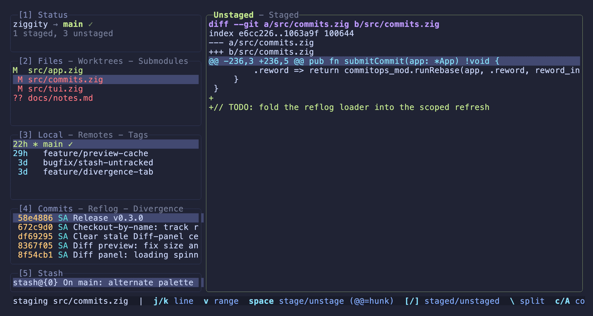

### Commits & History

The Commits panel previews each commit's diff, including its GPG signature
status; `enter` opens the commit's changed files.

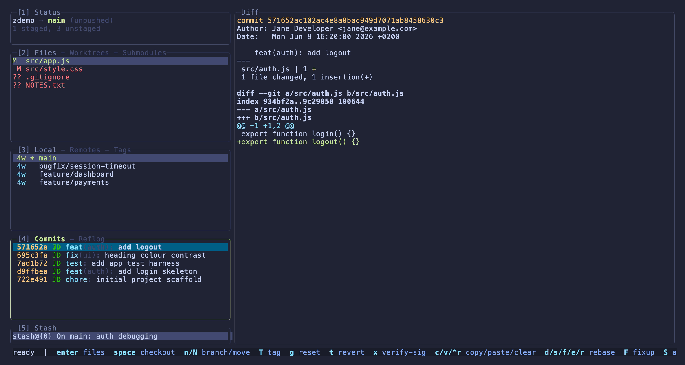

`ctrl+l` opens the real `git log --graph` DAG in git's own colors. By default
it shows the current branch **and its upstream**, so the commits you are
behind by are visible right away; `a` toggles all branches. Jump to HEAD with
`@`, or to a commit's first parent with `p`.

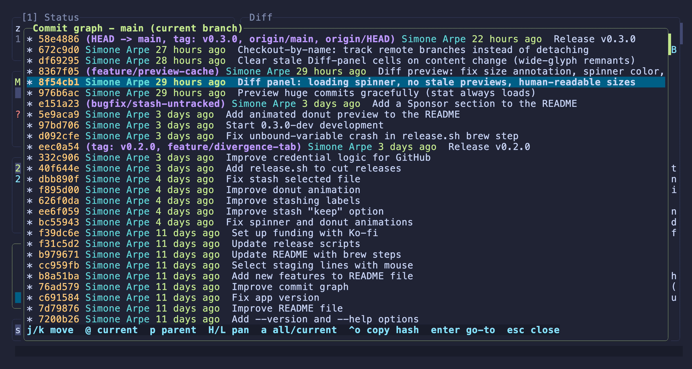

Full interactive rebase: press `i` on a commit to open a plan editor, mark
`pick` / `drop` / `squash` / `fixup` / `edit`, reorder with `ctrl+j` and
`ctrl+k`, then run it.

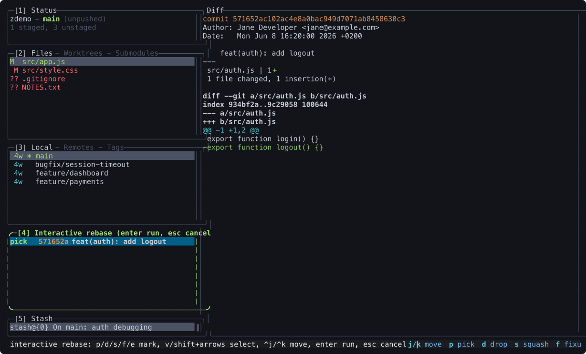

### Committing

`c` opens the commit dialog: a summary line plus an optional multiline body,
a live character count nudging the 50/72 rule, and optionally a
`prepare-commit-msg` hook prefill.

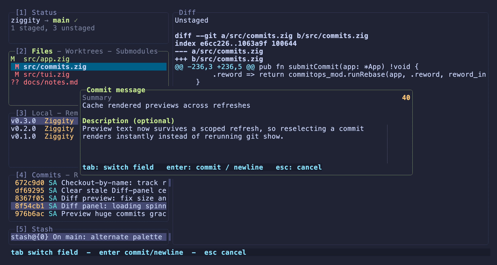

### Branches & Tags

The Branches panel shows ahead and behind arrows, upstream tracking and per
ref actions (merge, rebase, reset, checkout, and more); the Tags tab lists
tags with their messages.

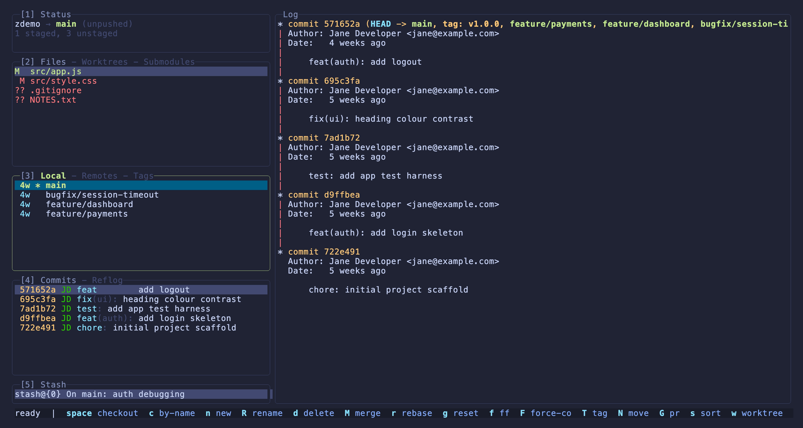

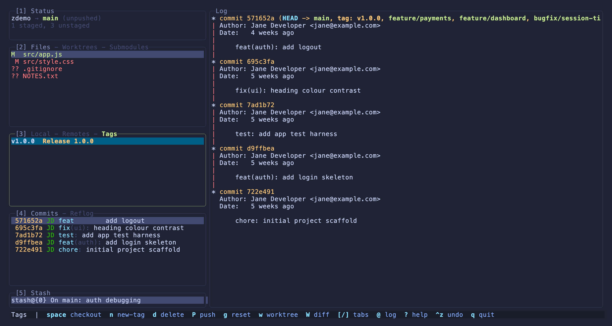

### Stash

A Stash panel with a diff preview. The stash menu (`s`) offers every variant
(all, plus untracked, staged only, a single file, keep the working tree),
each with an optional message, and `w` writes any stash to a `git apply`
ready patch file.

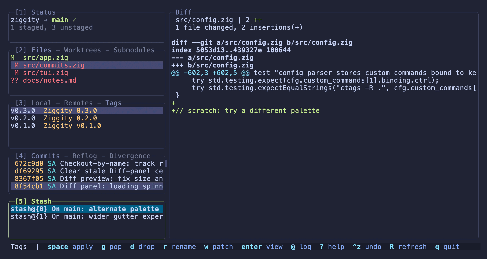

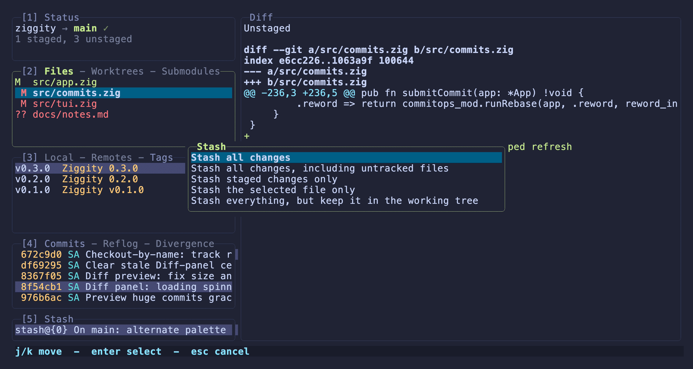

### Diffing & Menus

Mark any ref and diff another against it (`W`), with reverse and merge base
options. Destructive actions route through clear, explicit menus.

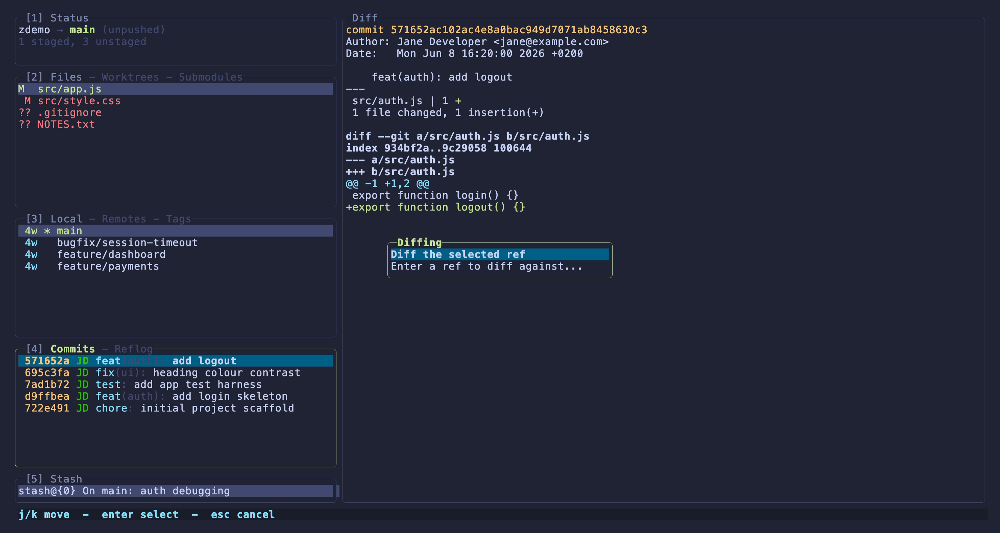

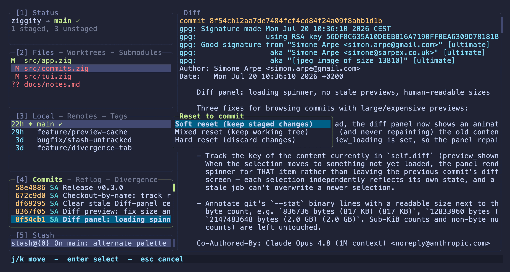

### Recent Repositories

`ctrl+r` opens the recent repositories switcher: every repo you have opened
before, aligned as name, branch, and path. `j` and `k` or the wheel move the
highlight, `H` and `L` pan long paths, `enter` switches in place, and `d`
removes an entry.


### Help & the About Screen

`?` opens the keybindings overlay, scrolled to the panel you are on.
Selecting the Status panel shows an about screen with a live animation.

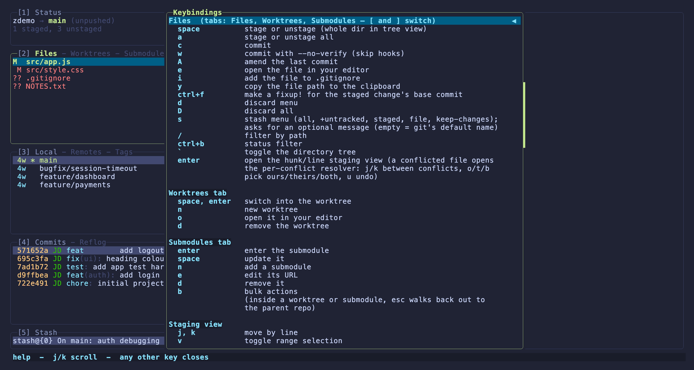

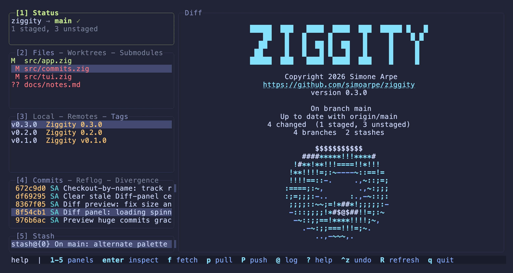

## Features

<details open>
<summary><b>Working tree &amp; staging</b></summary>

- Files panel from `git status --porcelain -z`; stage or unstage a file
  (`space`) or everything (`a`).
- Staging by hunk and line: `enter` opens a staging view to stage or unstage
  single lines (`v` for a range) or whole hunks (`tab` switches the unstaged
  and staged sides; `\` toggles the split view, see
  [Staging layout](#staging-layout-staging_split)).
- Directory tree view (`` ` ``) for working tree files **and** a commit's or
  branch's file list: a `/` root, collapsible folders (`enter`), single child
  chains compressed to `a/b/c`. Selecting a folder shows the combined diff
  beneath it; in the Files panel `space` stages the whole folder.
- Live fuzzy path filtering (smart case subsequence) with recent filter
  recall, plus a status filter (staged, unstaged, tracked, untracked).
- Discard a file, or a whole folder in tree view (`d` on a directory), via a
  menu (all, or unstaged only), or discard everything (`D`, confirmed). Add
  to `.gitignore` (`i`), copy a path (`y`).
- Scoped periodic refresh for external changes, plus a full refresh when the
  terminal regains focus.

</details>

<details>
<summary><b>Branches, tags &amp; remotes</b></summary>

- Branches panel from `git branch --format`: a "time ago" column, per branch
  tracking status (`✓` in sync, `↑` and `↓` for ahead and behind, `(gone)`),
  and the upstream ref shown only when it is not the obvious
  `origin/<same name>`.
- Branch actions (Local tab): new (`n`), rename (`R`), delete (`d`), merge
  (`M`), rebase (`r`), fast forward (`f`), checkout by name (`c`), reset
  (`g`), force checkout (`F`), tag (`T`), move commits to a new branch (`N`),
  open the pull request page (`G`), sort menu (`s`).
- Tags tab: checkout (`space`, detached), create (`n`, lightweight or
  annotated; overwrite prompts for `--force`), push to a remote (`P`), reset
  onto it (`g`), delete (`d`, local, remote, or both). One remote skips the
  remote prompt.
- Remotes tab: list remotes, drill into a remote's branches, add (`n`), edit
  URL (`e`), remove (`x`), set the current branch's upstream (`u`), delete a
  remote branch (`d`).
- Worktrees and Submodules tabs (Files panel): list, create or add, open,
  update, remove, a submodule bulk menu (`b`), and **switching repositories
  in place**: `space` or `enter` on a worktree (or `enter` on a submodule)
  reroots the app onto it, with a `parent / current` breadcrumb and `esc` to
  walk back out.

</details>

<details>
<summary><b>Commits &amp; history</b></summary>

- Recent commits from `git log`, loaded incrementally (the log grows as you
  scroll toward the end, so it is never capped), each row showing the
  author's initials in a stable per author color and a highlighted
  [Conventional Commits](https://www.conventionalcommits.org/) prefix (type
  in accent, scope muted, breaking `!` in red;
  `highlight_conventional_commits`). The short hash is tinted by push state:
  **red** for commits not yet on the remote, the usual yellow once pushed.
- Three tabs (`[` and `]` to switch): **Commits**, a **Reflog** recovery view
  (checkout `space`, reset HEAD `g`, branch `n`), and a **Divergence** view
  of the current branch versus its upstream, with `↑` outgoing commits
  grouped above `↓` incoming ones. The Divergence tab is read only: checkout,
  branch off, copy, paste and diff work; history editing keys are disabled.
- Commit (`c`), commit `--no-verify` (`w`), amend (`A`) in a centered editor
  with a summary line and optional multiline body (`tab` switches fields).
  The editor nudges you toward the
  [50/72 rule](https://dev.to/noelworden/improving-your-commit-message-with-the-50-72-rule-3g79):
  the summary shows a live character count (yellow, turning red once it
  exceeds `commit_summary_limit`, default 50), and the description shows a
  soft vertical guide at the body wrap column (`commit_body_guide`, default
  72, `0` off). When the editor opens, the repo's `prepare-commit-msg` hook
  runs (as it would for an interactive commit) and prefills the fields,
  editable before you commit (`prepare_commit_msg_hook = true`, disable to
  skip it).
- Per commit: reset (`g`, soft, mixed or hard), revert (`t`), checkout
  (`space`, detached), branch from it (`n`), move commits to a new branch
  (`N`), tag (`T`), change author (`a`), and a copy menu (`y`: hash, subject,
  author).
- GPG signatures: a signed commit's diff shows git's verification block
  (`--show-signature`), and `x` verifies the selected commit's signature on
  demand (result in a dialog), with no per row cost.
- A navigable changed file list per commit (`enter`); `d` there discards a
  file's changes from that commit (rebase plus amend).
- Commit graph viewer (`ctrl+l`): the real `git log --graph` DAG in git's
  colors, loaded off the interface thread. The default view shows the current
  branch and its upstream (so incoming commits are visible); `a` toggles all
  branches. `@` jumps to HEAD, `p` to the first parent, `enter` jumps the
  selection; mouse scroll, drag and click supported.
- Log filtering (`/`): by message (`--grep`), author, or path; persists
  across refreshes and shows in the panel title.
- Bisect (`b`): mark the selected commit good or bad, then keep marking
  until the first bad commit is found.

</details>

<details>
<summary><b>Interactive rebase &amp; patches</b></summary>

- Per commit interactive rebase: drop (`d`), squash (`s`), fixup (`f`), edit
  (`e`), reword (`r`), move (`ctrl+j` and `ctrl+k`), create a `fixup!` (`F`),
  autosquash (`S`).
- Rebase plan editor (`i`): compose a plan for the commits down to the
  selected one, mark each action (with range select to mark or reorder many
  at once), then run it as one rebase.
- Cherry picking: copy commits to a clipboard (`c`), paste onto HEAD (`V`),
  clear (`C`).
- Custom patch building (`ctrl+p`): toggle files into a patch (`space` in a
  commit's file list), then apply it to the working tree (forward or
  reverse), remove it from its source commit, or reset it.
- `rebase --onto` from a marked base (`B`), and mid rebase amend (`m` can
  amend the stopped `edit` commit and continue).
- Conflict resolution: `enter` on a conflicted file opens a per conflict
  resolver with line numbers. `j` and `k` walk between conflicts, `o`, `t`
  and `b` keep ours, theirs or both for the current one, `u` undoes the last
  pick, and the file is staged automatically once the last conflict is
  resolved. `m` still offers the whole operation continue and abort actions;
  `MERGING` or `REBASING` shows in the Status panel.

</details>

<details>
<summary><b>Multi selection, diffing &amp; stash</b></summary>

- **Range select** in any list: `v` toggles a sticky range, `shift+arrows`
  extend one, `*` (Commits) selects every commit unique to the branch. The
  action key then applies to the whole range: stage, discard or edit files,
  drop, squash, fixup, edit, move, revert or copy commits, delete branches or
  tags, drop stashes, toggle commit files into a patch, or discard files from
  a commit.
- Diffing mode (`W`): press `W` on a commit or branch to mark it as the base
  (the row keeps a colored diamond marker and an explanatory note opens),
  select another ref, and the main panel shows `git diff` between the two.
  `W` again opens the options: invert the direction, switch the dots, enter
  an arbitrary ref, or exit. The Diff title always shows the live state in
  git's own notation with the real ref names (`main...feature/login`, with a
  full SHA shortened to its short hash): `base..selected` is the full two
  dot difference, `base...selected` the three dot view (only the selected
  side's changes since the refs diverged, what a pull request shows), and
  inverting swaps the order around the dots. Branch bases default to three
  dots, commit and tag bases to two.
- Stash menu (`s`): stash all, all plus untracked, staged only, just the
  selected file, or keep everything (snapshot into a stash, untracked files
  included, while leaving the working tree untouched). Each asks for an
  optional message (empty = git's default `WIP on ...` name). Apply, pop,
  drop, rename (`r`), or write to a patch file (`w`, producing
  `stash-<n>.patch`, untracked included, `git apply` ready) on the Stash
  panel.

</details>

<details>
<summary><b>UX &amp; quality of life</b></summary>

- **Calm feedback:** fast actions succeed silently with a one line summary;
  only failures pop a dialog. Slow multistep actions (merge, rebase,
  autosquash, patch apply, fast forward, bisect) and network operations
  (fetch, pull, push) run off the interface thread with a spinner while
  navigation stays live. Tunable via `result_dialog` and `command_output`.
- **Fetch, pull and push that never block** (`f`, `p`, `P`) with a status
  indicator.
- **Credential entry in the app:** on an HTTPS auth failure, a username plus
  masked token prompt feeds git for the session. No external helper needed,
  and a stale keychain entry cannot shadow what you type.
- Safe undo of the last operation (`ctrl+z`, reflog reset after
  confirmation); undoing a commit or amend keeps the changes staged instead
  of losing them.
- Recent repositories switcher (`ctrl+r`): jump to another repo you have
  opened before, without restarting (see below).
- Find the fixup base for a staged change and make a `fixup!` (`ctrl+f`, via
  blame).
- Mouse text selection with automatic copy in the diff panel and the read
  only dialogs (OSC 52); copy a hash, branch or tag (`ctrl+o`); open a commit
  or branch on its remote host (`o`), with the right URL shape for GitHub,
  GitLab and Codeberg.
- Command log overlay (`@`), themeable colors, fully remappable keys, and
  user defined custom commands.

</details>

## Keybindings

Press **`?`** in the app for the full, always current overlay. The
essentials:

| Key | Action |
|---|---|
| `1`–`5` | Focus Status / Files / Branches / Commits / Stash (press again to cycle that panel's tabs) |
| `h` `l` / arrows | Move focus between side panels |
| `j` `k` / arrows | Move selection |
| `tab` | Focus the Diff panel (and back) |
| `z` | Maximize the Diff panel to full screen (`z` or `esc` to exit) |
| `[` `]` | Switch the focused panel's tabs (or staging side) |
| `enter` / `esc` | Inspect in the main panel / step back |
| `space` | Stage file · checkout branch · apply stash (by focus) |
| `c` · `a` · `d` · `D` | Commit · stage all · discard menu · discard all |
| `v` · `shift+arrows` · `*` | Start range · extend range · select branch commits |
| `i` · `ctrl+p` · `ctrl+l` | Rebase plan · custom patch · commit graph |
| `f` · `p` · `P` | Fetch · pull · push |
| `z` · `@` · `?` · `q` | Undo · command log · help · quit |

<details>
<summary><b>Full keybinding reference</b></summary>

- `q` / `ctrl+c`: quit
- `R`: refresh
- `?`: keybindings help overlay (`j` and `k` to scroll), opened to the
  section for the current panel
- `ctrl+z`: undo the last operation (reflog reset, after confirmation)
- `ctrl+r`: switch to a recently opened repository (see below)
- `ctrl+w`: toggle soft-wrapping of long lines in the diff panels (see below)
- `@`: command log (recent git commands ziggity ran)
- `ctrl+o`: copy the selected hash, branch or tag to the system clipboard
- `o`: open the selected commit or branch on its remote host in the browser
  (GitHub, GitLab and Codeberg URL styles are handled)
- `W`: diffing mode. Marks the selected ref as the base; select another to
  diff, `W` again for options (invert, switch the dots, arbitrary ref, exit;
  esc also exits)
- mouse: click a panel to focus; wheel to navigate and scroll; drag over the
  diff or a dialog to select and copy text
- `/`: filter files by path live; enter accepts; esc clears
- `` ` ``: toggle the directory tree view, in the Files panel **and** in a
  commit's or branch's file list. `enter` collapses or expands the folder
  under the cursor; `space` stages a whole directory (Files) or adds it to
  the custom patch (commit files); the `/` root nests everything and diffs
  all changes when selected
- `ctrl+b`: files status filter menu
- `j` / `k` or arrows: move selection · `h` / `l` or arrows: cycle side
  panels
- `H` / `L`: scroll the focused panel left and right (diff, or a list wider
  than the panel)
- `tab`: focus the Diff panel from any side panel (press again to return).
  Over a working tree file, `enter` there opens its staging view (the panel
  title and footer show the hint)
- `z`: maximize the Diff panel to full screen; the side panels hide and the
  diff fills the terminal; press `z` again or `esc` to restore the layout
- `1`–`5`: focus status / files / branches / commits / stash; pressing the
  number of the already-focused panel cycles its tabs (so `3` walks
  Local/Remotes/Tags), the same way `]` does. Turn this off with
  `switch_tabs_with_panel_keys = false`.
- `[` / `]`: switch panel tabs (Files/Worktrees/Submodules ·
  Local/Remotes/Tags · Commits/Reflog) or the staging side
- `enter`: inspect in the main panel; on a commit, drill into its changed
  files; on a file, open the staging view
- `enter` on a file opens the staging view: `j` and `k` by line, `J` and `K`
  (or shift+arrows) jump to the next/previous hunk, `v` range, `space` stage
  the line(s) or hunk, `[` and `]` switch side, `\` split view, `c` and `A`
  commit or amend, `esc` back
- `space`: stage or unstage a file · checkout a branch · apply a stash (by
  focus)
- `e`: open the file under view in your editor (Files, a commit's files, the
  staging or patch view, or a working tree file's diff; see
  [Editor](#editor-e))
- `n`: new branch from HEAD (Branches, Local)
- `c`: checkout a branch or ref by name (switches to a local name, tracks a
  remote one, detaches onto a tag or commit, and `-` returns to the previous
  branch)
- `R`: rename the selected local branch (refresh elsewhere)
- `f`: fast forward the selected local branch (fetch elsewhere)
- `d`: delete the selected local branch (menu: delete, or force delete)
- `M` / `r`: merge the selected branch / rebase the current branch onto it
- `g` / `F` (Branches Local): reset to the branch / force checkout
- `T` / `N` (Branches Local): tag the branch / move its commits to a new
  branch
- `G` / `s` (Branches Local): open the PR page / branch sort menu
- `space` (Remotes/Tags): check out the remote branch or tag
- `n` / `P` / `g` / `d` (Tags): new tag / push to a remote / reset onto it /
  delete
- `g` / `t` (Commits): reset menu / revert
- `x` (Commits): verify the selected commit's GPG signature (result in a
  dialog)
- `space` / `n` / `N` (Commits/Reflog): checkout (detached) / branch from it
  / move commits to a new branch
- `T` / `a` (Commits): tag the commit / change its author
- `y` / `C`: copy menu / clear the cherry pick selection
- `i` (Commits): interactive rebase plan editor
- `ctrl+l` (Commits): commit graph viewer (`j` and `k` move, `@` HEAD, `p`
  first parent, `H` and `L` pan, `a` toggle all branches, `ctrl+o` copy,
  `enter` jump, `esc` close; mouse scroll, drag and click)
- `G` (Commits): open the new pull/merge request page (GitHub, GitLab,
  Codeberg, Bitbucket) · `B`: mark a `rebase --onto` base
- `W`: diff the selected commit or branch against another marked ref
- `/` (Commits): filter the log · `b` (Commits): bisect menu
- `ctrl+p`: custom patch menu; `space` in a commit's files adds a file to the
  patch
- `a`: stage all (or unstage all) · `s` (Files): stash menu
- `d` / `D`: discard menu for the file / discard all (confirmed)
- `c` · `w` (Files): commit · commit `--no-verify`
- `i` / `y` / `ctrl+f` (Files): add to `.gitignore` / copy path / make a
  `fixup!`
- `r` (Stash): rename the selected stash
- `e` / `x` / `u` (Remotes): edit URL / remove remote / set upstream
- `m`: merge and rebase actions (continue, amend and continue, abort) while
  one is in progress, available from any panel, so you never have to switch
  to Files to continue or abort
- `f` / `p` / `P`: fetch / pull / push
- `esc`: step back one level (deselect, clear a filter, exit diffing, cancel
  a prompt, leave a panel); never quits, only `q` does

</details>

### Cycle Tabs with the Panel Key

The Branches, Files and Commits panels each have tabs (`[` and `]` switch
them). You can also walk those tabs with the panel's own number key: press it
once to focus the panel, then press it again to move to the next tab. So `3`
goes Branches, then Local, Remotes, Tags; `4` goes Commits, then Reflog and
Divergence; `2` walks Files, Worktrees and Submodules. The key still jumps
straight to the panel from anywhere else, so nothing is lost. It is on by
default and can be turned off with `switch_tabs_with_panel_keys = false`.

<p align="center">
  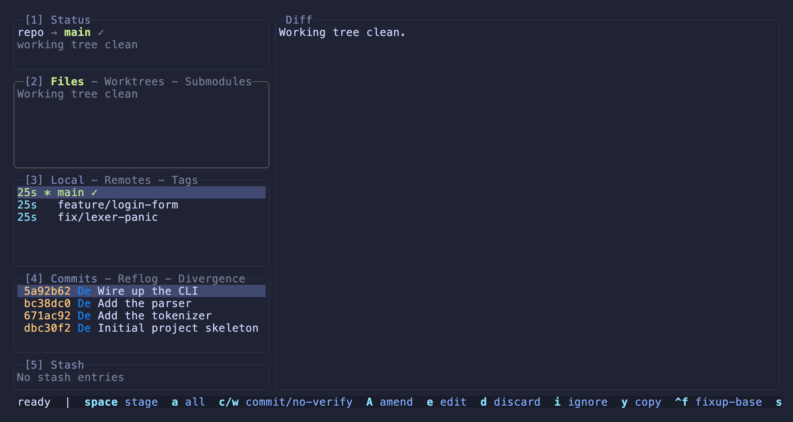
</p>

<p align="center"><i>Pressing 3 repeatedly walks Local, Remotes and Tags; 4 walks Commits, Reflog and Divergence.</i></p>

## Configuration

Ziggity loads its defaults, then reads (each overriding the previous):

1. the path in `ZIGGITY_CONFIG`
2. `<repo>/.ziggity.ini`

There is **no** auto loaded global file (no `~/.config/ziggity/`, no XDG
path). To apply settings everywhere, point `ZIGGITY_CONFIG` at a file from
your shell profile, e.g.
`export ZIGGITY_CONFIG="$HOME/.config/ziggity/config.ini"`, and a repo's
`.ziggity.ini` overrides those per repo. Without any file, settings fall back
to per repo auto detection (notably the editor).

<details>
<summary><b>All settings (annotated <code>.ini</code>)</b></summary>

```ini
side_panel_width_percent = 34
diff_context = 3

# The commit summary character count (shown in the commit and reword dialog)
# turns red once it goes over this many characters; below it, it stays
# yellow. Default 50 (the git subject length convention). Set to 0 to disable
# the red threshold so the count always stays yellow.
commit_summary_limit = 50

# Column of the soft vertical guide drawn in the commit and reword message
# body, marking the git body wrap width. Default 72. Set to 0 to disable it.
commit_body_guide = 72

# Color the Conventional Commits prefix (`type(scope)!:`) in the commit
# list: type in accent, scope muted, breaking `!` in red. Default on.
highlight_conventional_commits = true

# Run the repo's prepare-commit-msg hook when the commit dialog opens and
# prefill the message from its output (e.g. a ticket prefix derived from the
# branch), matching an interactive commit. Default on; false skips the hook.
prepare_commit_msg_hook = true

# Seconds between idle background working tree refreshes (git status, run
# off the interface thread). On a big repo a tight interval makes git status
# thrash; default 10. Set to 0 to disable the periodic refresh (it still
# refreshes after operations and when the terminal regains focus).
refresh_interval_secs = 10

# Seconds between quiet background `git fetch`es so the incoming commit
# count (the inbound arrow) updates on its own. Ahead and behind are
# measured against the remote tracking ref, which only advances on a fetch.
# It never prompts: if the remote needs credentials (and no helper has them
# cached) it fails silently. Set to 0 to disable. Default 60.
fetch_interval_secs = 60

# Side panel layout: the Status panel is a fixed height, the Files, Branches
# and Commits lists share the rest equally, and Stash stays small unless it
# is focused. Enable the accordion to grow the focused list panel.
expand_focused_side_panel = false  # focused list panel expands, others shrink
expanded_side_panel_weight = 2     # how much bigger the focused panel gets
staging_split = auto               # staging layout: off | on | auto (default)

# Editor for `e`. With nothing set, auto detected from git core.editor, then
# $GIT_EDITOR, $VISUAL, $EDITOR, falling back to vim. See "Editor" below.
editor_preset =                    # vim | nvim | nano | emacs | micro | helix | vscode | sublime | zed | ...
editor_command =                   # explicit template, e.g. "code --reuse-window -- {{filename}}"
editor_in_terminal =               # true = suspend the TUI (terminal editors); false = just launch (GUI)

# Action feedback. Default: silent success plus a bottom bar summary, and
# dialogs only on failure.
result_dialog = on_error    # on_error (default) | always | never
command_output = show       # show (default) custom command output in a dialog,
                            # or `silent` to follow result_dialog instead

# Skip the confirm prompt for individual destructive actions (all default
# false, i.e. confirmations stay on). Names match the action:
skip_confirm.discard_all = false
skip_confirm.merge_branch = false
skip_confirm.rebase_branch = false
skip_confirm.delete_tag = false
skip_confirm.delete_remote_branch = false
skip_confirm.remove_worktree = false
skip_confirm.remove_remote = false
skip_confirm.undo = false
skip_confirm.force_push = false        # auto --force-with-lease when a push is rejected
skip_confirm.force_push_plain = false  # auto --force when force-with-lease is rejected

# Any keymap field can be remapped with key.<name>:
key.quit = q
key.refresh = R
key.file_filter = /
key.open_status_filter = ctrl+b
key.discard = d
key.commit = c
key.push = P
key.select = space
key.rename = R
key.fast_forward = f
key.reset = g
key.revert = t
key.range_select = v
key.paste_commits = V
key.select_branch_commits = *
key.toggle_tree = `
key.toggle_fullscreen = z
key.conflict_menu = m
key.command_log = @

# Theme colors are terminal palette indices (0-255):
color.selected_bg = 4
color.inactive_selected_bg = 8   # selected row in an unfocused panel (dimmer)
color.active = 10
color.added = 10
color.removed = 9
color.staged = 10
color.unstaged = 9
color.warning = 11
color.hunk = 14
color.header = 13
color.accent = 14
color.muted = 8
color.hash = 3                   # commit short hashes in the log
color.tag = 3                    # a tag's annotation and subject in the Tags list
```

Key values may be a single character or one of `space`, `enter`, `tab`,
`esc`, `backspace`, `ctrl+x`, or `alt+x`. Every binding is remappable via
`key.<name>`, every color via `color.<name>`.

**Custom commands** bind a key to a shell command run in the repo root
(output in a dialog by default, or the message line with
`command_output = silent`; the view refreshes afterward):

```ini
command.E = git commit --amend --no-edit
command.ctrl+t = ctags -R .
```

Custom commands take precedence over built in bindings and only run when you
press their key, so a repo local `.ziggity.ini` cannot run anything on its
own.

</details>

### Staging Layout (`staging_split`)

The staging view (`enter` or `tab` on a file) shows one pane (the active
side) or two side by side (Unstaged | Staged). `staging_split` decides how
each file opens:

| `staging_split` | File with one side | File with staged **and** unstaged |
|---|---|---|
| `off` | single | single |
| `on` | split | split |
| **`auto`** *(default)* | single | **split** |

`\` toggles split or single for the **current file only**. It is not
remembered, so the next file always opens with the layout above. The layout
is chosen when a file opens and not redecided mid edit.

### Editor (`e`)

`e` opens the file under view in an editor. The command is chosen in order:

1. **`editor_command`**: your explicit template. Use `{{filename}}` for the
   path (quoted for you); if omitted, the path is appended.
2. **`editor_preset`**: a named built in: `vi`, `vim`, `nvim`, `lvim`,
   `nano`, `emacs`, `micro`, `helix`, `kakoune`, `vscode`, `sublime`, `zed`,
   `bbedit`, `xcode`.
3. **Auto detection**: the first of git `core.editor`, `$GIT_EDITOR`,
   `$VISUAL`, `$EDITOR` (matched to a preset, or run as a terminal editor).
4. **Fallback**: `vim`.

Terminal editors (vim, nano, emacs, micro, helix, kakoune, and friends)
**suspend** ziggity and resume when you quit them; GUI editors (VS Code,
Sublime, Zed, and friends) just **launch**. `editor_in_terminal = true|false`
forces which behavior to use.

## Status & Roadmap

The feature parity roadmap against lazygit is **complete**. Known smaller
gaps:

- **Redo**: undo (`ctrl+z`) is implemented; redoing an undo is not.
- **Move a custom patch to a *different* commit**: only apply and remove
  from commit are implemented.
- **Editing the live rebase todo mid rebase**: ziggity composes the whole
  plan up front in its `i` editor (with range select), so there is no paused
  rebase todo view to edit.
- **Reword in your external `$EDITOR`**: ziggity rewords in its own editor
  (`r`), which serves the same purpose.
- **Full lazygit config compatibility** and **score based fuzzy ranking**
  (the current fuzzy filter matches but preserves order).

See [Why Ziggity](#why-ziggity) for where ziggity deliberately diverges, or
[`docs/ENHANCEMENTS_OVER_LAZYGIT.md`](docs/ENHANCEMENTS_OVER_LAZYGIT.md) for
the same list in short form.

## Development

```sh
zig build                                  # debug build
zig build test --summary all               # run all tests
zig build -Doptimize=ReleaseFast           # optimized build
```

### Source Layout

| File | Responsibility |
|---|---|
| `src/main.zig` | Process entry point and startup error reporting |
| `src/app.zig` | App state, focus, selections, actions, refreshes |
| `src/git.zig` | Git subprocess wrapper and parsers |
| `src/tui.zig` | libvaxis event loop, layout, and rendering |
| `src/model.zig` | Owned domain models and status derivation |
| `src/config.zig` | Defaults and the keybinding and INI parser |
| `src/actions.zig` | Action names shared by the app and key layers |

Supporting modules split cohesive areas out of `app.zig`: `staging.zig`,
`patch.zig`, `commitops.zig`, `rebaseplan.zig`, `drills.zig`,
`diffmode.zig`, `stash.zig`, `branches.zig`, `commits.zig`, `filetree.zig`,
`commitgraph.zig`, `editor.zig`, `diff.zig`, `credentials.zig`. All Git data
is loaded through `git` commands rather than reimplementing Git internals.

The gif tapes under `docs/assets/` regenerate with
[vhs](https://github.com/charmbracelet/vhs); run
`bash docs/assets/demo-repos.sh` first to set up the scratch repositories
they record against.

### libvaxis Gotcha: Cells Store Graphemes by Reference

libvaxis stores each screen cell's grapheme as a **slice into the source
text** (`Window.print` does `.grapheme = grapheme.bytes(segment.text)`; it
does not copy the bytes), and the frame is flushed **after** `render()`
returns. So any text drawn via vaxis `printSegment` or `print` must be backed
by memory that outlives `render()`: a string literal or an App owned buffer,
**never a stack local buffer** (which dangles and renders as garbage or
`U+FFFD`, intermittently).

In `src/tui.zig`:

- The local `print`, `printSpan` and `printAnsi` helpers are **safe** with
  any buffer lifetime (they map bytes through a static glyph table), so
  formatting into a stack buffer is fine for list rows, popups, the footer,
  and so on.
- Only vaxis `printSegment` is by reference, and it is used only for panel
  and popup titles; dynamic titles must live in an App owned buffer
  (`app.*_title_buf`).

## Sponsor

Ziggity is free and open source, built in spare time. If it saves you some
of yours, you can support its development on Ko-fi. No pressure, no paywalled
features, just a tip jar that helps keep the work going.

<p align="center">
  <a href="https://ko-fi.com/simoarpe">
    
  </a>
</p>

<p align="center"><a href="https://ko-fi.com/simoarpe">ko-fi.com/simoarpe</a></p>

You can also help for free: star the repo, report bugs, and tell a friend. 💛

## License

[MIT](LICENSE) © 2026 Simone Arpe.
