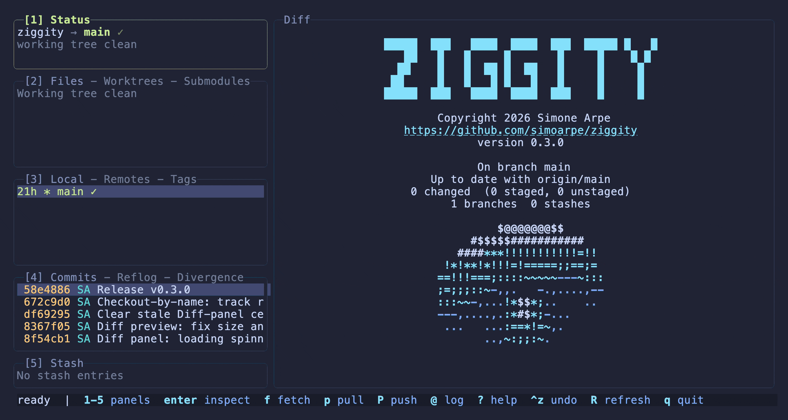
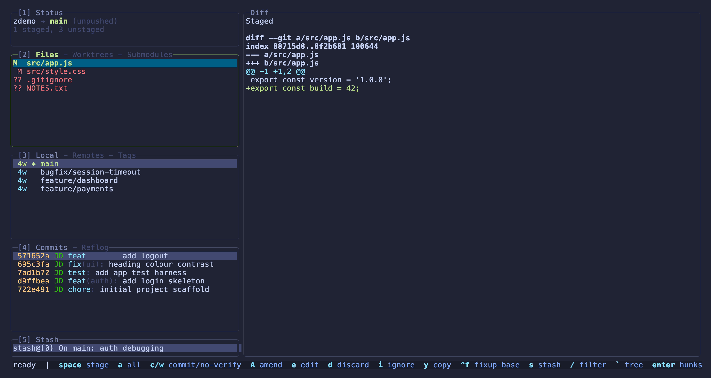
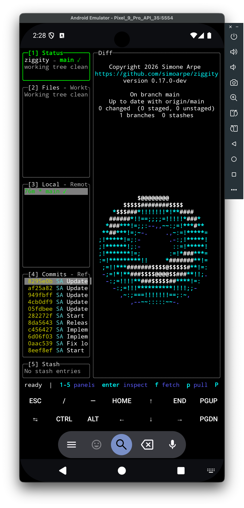
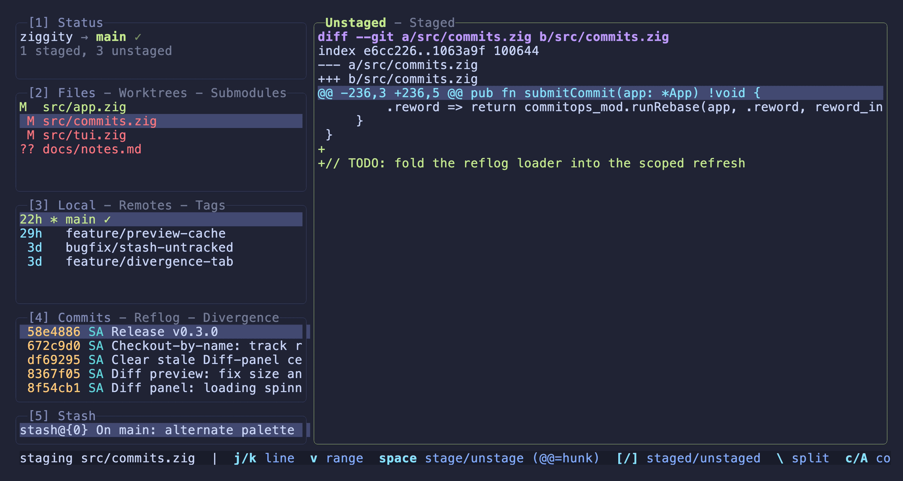
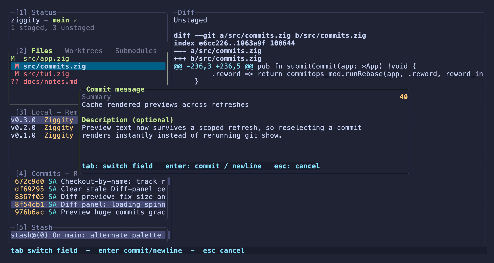
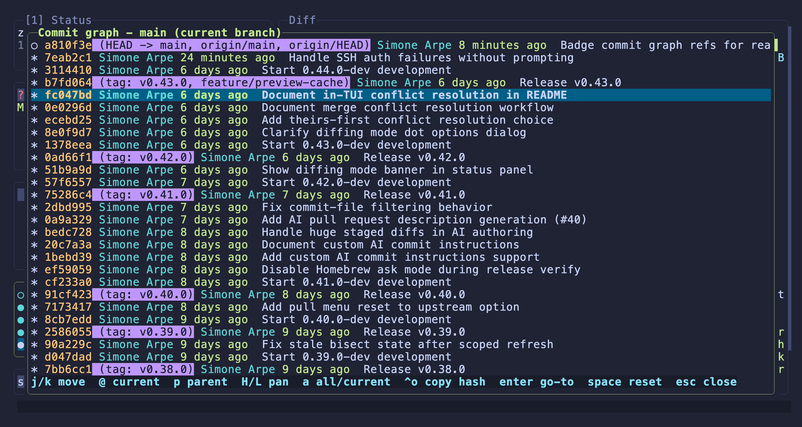
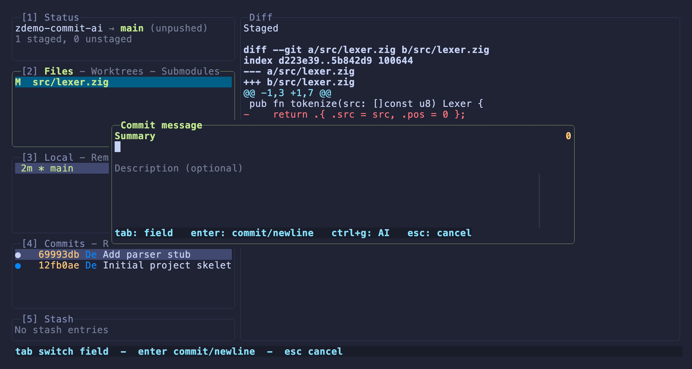

<p align="center">
  
</p>

<h1 align="center">ziggity</h1>

<p align="center">
  A fast terminal UI for Git, written in Zig.
</p>

<p align="center">
  <b>Fast with the keyboard.</b><br>
  <b>Natural with the mouse.</b><br>
  <b>No compromises.</b>
</p>

<p align="center">
  <a href="https://ziggity.dev"></a>
  
  
  
</p>

<p align="center">
  <b><a href="https://ziggity.dev">ziggity.dev</a></b>
</p>

<p align="center">
  <b>1.9 MB</b> binary · <b>3.6 ms</b> startup · <b>8 MB</b> memory when idle · no runtime, no toolchain, just <code>git</code>
</p>

<p align="center">
  
</p>

<p align="center"><i>The Status panel about splash. Yes, the donut spins.</i></p>

Ziggity keeps your entire Git workflow in one terminal window. Stage individual
lines, commit, branch, rebase interactively, inspect history, and review
changes with live diff previews. Every action is a keystroke. 
Any text can be selected and copied with the mouse. 

Long running Git operations never block the interface. Fetch, pull, push,
merge, rebase, autosquash, and bisect run in the background while navigation
remains responsive. Ziggity also includes thoughtful defaults that remove
friction from everyday workflows: checking out a remote branch tracks it
automatically, rejected pushes try the safe force (`force-with-lease`) before the
blunt one, branch diffs default to the merge base used by pull requests, and 
dragging over a diff copies exactly the selected text to your clipboard.

Inspired by the workflow that
[Lazygit](https://github.com/jesseduffield/lazygit) made popular, Ziggity is not
a port. It is written from scratch in Zig, talks directly to your existing
`git` installation (no libgit2), and deliberately makes different choices where
they improve the user experience. See
[docs/comparison.md](docs/comparison.md) for a detailed comparison.

[Website](https://ziggity.dev) · [Features](docs/features.md) ·
[Keybindings](docs/keybindings.md) · [Configuration](docs/configuration.md) ·
[Comparison with lazygit](docs/comparison.md)

## Why Ziggity?

- ⚡ 1.9 MB standalone binary
- 🚀 Starts in ~3.6 ms
- 🔄 Non-blocking Git operations
- 🖱️ First-class keyboard and mouse interaction
- 🤖 Optional AI commit messages, using the model or subscription you already have
- 🐙 Uses your existing `git` installation
- 🧩 No libgit2 dependency
- ⚙️ Written entirely in Zig
- 💻 Runs on macOS, Linux, and Windows
- 📱 Even on Android, in Termux

<p align="center">
  
</p>

<p align="center"><i>Status, Files, Branches, Commits and Stash panels with a live diff preview and a footer that follows context.</i></p>

## Installation

Ziggity needs the `git` command on your `PATH` at runtime, since it drives
git as a subprocess. Install via Homebrew, grab a prebuilt binary, or build
from source.

### Homebrew (macOS / Linux)

```sh
brew install simoarpe/ziggity/ziggity
```

That taps [`simoarpe/homebrew-ziggity`](https://github.com/simoarpe/homebrew-ziggity)
and installs the binary, the short form of:

```sh
brew tap simoarpe/ziggity
brew install ziggity
```

Upgrade with `brew upgrade ziggity`. Unlike a downloaded binary, a Homebrew
install is not quarantined, so it runs on macOS without a Gatekeeper prompt.

### Prebuilt Binaries

Every [release](https://github.com/simoarpe/ziggity/releases) ships static
binaries for macOS, Linux, Windows, and Android (Termux). No Zig toolchain
required.

#### macOS / Linux

Grab the archive for your platform from the releases page: `aarch64-macos` or
`x86_64-macos` for macOS, `x86_64-linux-musl`, `aarch64-linux-musl` or
`riscv64-linux-musl` for Linux (the musl builds are fully static and run on
any distro), then:

```sh
# set VERSION to the latest release and pick your OS/arch (see the releases page)
VERSION=v0.25.0
curl -LO https://github.com/simoarpe/ziggity/releases/download/$VERSION/ziggity-$VERSION-aarch64-macos.tar.gz
tar -xzf ziggity-$VERSION-aarch64-macos.tar.gz
sudo mv ziggity /usr/local/bin/      # or any directory on your PATH
command -v ziggity                   # confirm it is on your PATH
```

On macOS the binary is not notarized, so Gatekeeper may block it on first
run. Clear the quarantine flag once:

```sh
xattr -d com.apple.quarantine /usr/local/bin/ziggity
```

#### Windows

Download `ziggity-v0.25.0-x86_64-windows-gnu.zip`, unzip it, and put
`ziggity.exe` in a folder on your `PATH`. Requires
[Git for Windows](https://git-scm.com/download/win).

> **Note:** Windows builds are cross compiled and not yet smoke tested on
> Windows. Treat them as experimental for now.

#### Android (Termux)

Ziggity runs on Android inside [Termux](https://termux.dev). The binary is a
static aarch64 ELF with no libc, so it needs no NDK and no root; Termux supplies
the terminal and `git`.

<p align="center">
  
</p>

<p align="center"><i>The full TUI, spinning donut and all, in Termux on Android.</i></p>

```sh
# In Termux:
pkg install git
# set VERSION to the latest release (see the releases page)
VERSION=v0.25.0
curl -LO https://github.com/simoarpe/ziggity/releases/download/$VERSION/ziggity-$VERSION-aarch64-linux-android.tar.gz
tar -xzf ziggity-$VERSION-aarch64-linux-android.tar.gz
# Move it into Termux's own bin; Android forbids exec from shared storage.
mv ziggity $PREFIX/bin/ && chmod +x $PREFIX/bin/ziggity
cd ~/some-git-repo && ziggity
```

Everything works as on desktop Linux. Optional extras use Termux's tools when
present: `o`/`G` open links via `termux-open-url` (from `pkg install
termux-api`), and PR status needs `gh`/`glab` installed and authenticated.

> **Note:** verified in Termux on an emulator; treat as experimental until it
> has more real-device mileage.

#### Verify the Download (Optional)

Each release includes a `checksums.txt`:

```sh
sha256sum --ignore-missing -c checksums.txt   # macOS: shasum -a 256 --ignore-missing -c checksums.txt
```

### Compile from Source

**Requirements:** [Zig `0.16.0`](https://ziglang.org/download/) and `git` on your `PATH`.

```sh
git clone https://github.com/simoarpe/ziggity
cd ziggity
zig build -Doptimize=ReleaseSafe     # binary at ./zig-out/bin/ziggity
zig build test                       # (optional) run the test suite
```

The build leaves the binary at `./zig-out/bin/ziggity`. **Add it to your
`PATH`** so you can run `ziggity` from anywhere. Either copy it into a
directory already on your `PATH`:

```sh
sudo cp zig-out/bin/ziggity /usr/local/bin/
```

or add `zig-out/bin` to your `PATH` (e.g. in `~/.zshrc` or `~/.bashrc`):

```sh
export PATH="$PWD/zig-out/bin:$PATH"
```

#### Cross-compile for another target

Zig cross-compiles to any target with `-Dtarget=<arch>-<os>-<abi>`, no extra
toolchain required. For example, the Android (Termux) binary:

```sh
zig build -Dtarget=aarch64-linux-android -Doptimize=ReleaseSafe
# static ARM64 binary at ./zig-out/bin/ziggity, ready to sideload into Termux
```

The same works for every release target: `x86_64-linux-musl`,
`aarch64-linux-musl`, `riscv64-linux-musl`, `aarch64-macos`, `x86_64-macos`,
`x86_64-windows-gnu`. The musl and Android Linux builds are fully static (no
libc), so each runs on any device of that architecture.

## Quick Start

Run `ziggity` inside any Git repository. Press `?` for the keybindings
overlay (it opens scrolled to the panel you are on), and `q` to quit.

## Design Philosophy

If lazygit already works for you, great: it is an excellent tool. Ziggity
exists because a few everyday interactions could be quicker, more efficient,
or more predictable, and because Zig makes it possible to deliver that in a
tiny native binary.

Ziggity compiles to a single static binary with no runtime, no garbage
collector, and no library dependencies beyond the `git` you already have.
Measured on an Apple M1 Max running macOS 26.5.1, against lazygit 0.62.2 from
Homebrew, both opening the same repository (ziggity's own: 359 commits, 156
tracked files, 21 refs, a working checkout with build output on disk) at the
same terminal size, median of seven runs:

| | ziggity 0.14.0-dev | lazygit 0.62.2 |
|---|---|---|
| Binary size | **1.9 MB** | 17.6 MB |
| Dynamic libraries linked | **1** | 4 |
| Process startup, median of 30 runs | **3.6 ms** | 21.2 ms |
| Git subprocesses to load the repo | **16** | 25 |
| Peak git processes running in parallel | **11** | 9 |
| Network during load | **none** | `git fetch --all` |
| Resident memory once settled | **8 MB** | 36 MB |
| Peak resident memory while loading | **8 MB** | 36 MB |
| Git subprocesses over 10 s idle | **22** | 40 |
| Own CPU time over 10 s | **40 ms** | 250 ms |
| Total CPU including git children | **0.48 s** | 0.73 s |

Ziggity holds about a fifth of lazygit's memory and stays flat there from the
first paint, and both tools fetch: lazygit during load, ziggity about three
seconds later off the interface thread. The whole table
comes out of one command, [`docs/bench`](docs/bench/), so you can re-run it
rather than take it on trust. [docs/comparison.md](docs/comparison.md) has the
methodology behind every row, the subprocess log, and the honest case point by
point, with demos:

- [Small and Fast](docs/comparison.md#small-and-fast)
- [Nothing Blocks, Ever](docs/comparison.md#nothing-blocks-ever)
- [Copy Text Straight from the Screen](docs/comparison.md#copy-text-straight-from-the-screen)
- [The Mouse Works Everywhere](docs/comparison.md#the-mouse-works-everywhere)
- [At Home in Any Terminal](docs/comparison.md#at-home-in-any-terminal)
- [Checkout by Name That Lands on a Real Branch](docs/comparison.md#checkout-by-name-that-lands-on-a-real-branch)
- [A Commit Editor That Nudges the 50/72 Rule](docs/comparison.md#a-commit-editor-that-nudges-the-5072-rule)
- [AI Commit Messages, Your Own Model](docs/comparison.md#ai-commit-messages-your-own-model)
- [A Force Push That Never Dead Ends](docs/comparison.md#a-force-push-that-never-dead-ends)
- [Diffs the Way Review Tools Show Them](docs/comparison.md#diffs-the-way-review-tools-show-them)
- [Word-Level Diff Highlighting](docs/comparison.md#word-level-diff-highlighting)
- [Wrap Long Lines On Demand](docs/comparison.md#wrap-long-lines-on-demand)
- [History Navigation with Intent](docs/comparison.md#history-navigation-with-intent)
- [Two Histories Side by Side](docs/comparison.md#two-histories-side-by-side)
- [Jump Between Repositories](docs/comparison.md#jump-between-repositories)
- [Stash Without Losing Your Working Tree](docs/comparison.md#stash-without-losing-your-working-tree)
- [Small Courtesies](docs/comparison.md#small-courtesies)

## Features

- **Staging down to the line**: open a file and stage single lines or whole
  hunks. `d` discards at the same granularity, so one bad line goes away
  without touching the rest of the file, and a split view can show unstaged
  and staged side by side.
- **Interactive rebase you compose first**: mark drop, squash, fixup, edit
  and reword across a range of commits in a plan editor, then run the lot as
  one rebase. Cherry picking, autosquash, custom patch building and
  `rebase --onto` from a marked base are all there.
- **History and diffing**: the real `git log --graph` DAG in git's own
  colors, first parent jumps for walking a merge heavy history, and branch
  comparisons that default to the merge base, the same diff a pull request
  shows.
- **A real commit editor**: a summary line and multiline body, a live count
  nudging the 50/72 rule, and your repository's `prepare-commit-msg` hook run
  on open, so a branch ticket prefix finally lands in a terminal UI.
- **AI commit messages, optional**: `ctrl+g` drafts the subject and body from
  the staged diff with a tool you choose. [`pi`](https://github.com/earendil-works/pi)
  is the way to go and covers everything, subscriptions you already have
  included; [`llm`](https://github.com/simonw/llm) or a local
  [`ollama`](https://github.com/ollama/ollama) model work too. It never
  overwrites your edits, and ziggity ships no model or key of its own.
- **Range select anywhere**: `v` or `shift+arrows` mark a range in any list,
  then one key acts on every file, commit, branch or stash in it; `*` selects
  a branch's own commits.
- **Stays current on its own**: a quiet background fetch keeps the incoming
  commit count accurate, and commit hashes stay red until they reach the
  remote, so what is safe to rewrite is visible at a glance.
- **The mouse works everywhere**: click a panel or row to focus and select,
  click a line in the staging view to land the cursor there rather than
  walking down hunk by hunk, and scroll every list, dialog and the graph.
  Selected text copies over SSH too, through OSC 52.
- **Undo and recovery**: `ctrl+z` walks the last operation back through the
  reflog, and undoing a commit or amend returns the changes staged instead of
  dropping them. The stash menu can snapshot everything, untracked files
  included, and still leave your working tree untouched.
- **Explicit and configurable**: fully remappable keys, themeable colors,
  custom commands, `ctrl+r` to switch between repositories you have opened,
  and an in-app prompt for HTTPS credentials so nothing takes over your
  terminal.

<p align="center">
  
</p>

<p align="center"><i>Stage or unstage single lines or whole hunks with <code>space</code>; <code>d</code> discards them instead.</i></p>

<p align="center">
  
</p>

<p align="center"><i><code>c</code> opens the commit dialog: a summary line plus an optional multiline body, and a live character count nudging the 50/72 rule.</i></p>

<p align="center">
  
</p>

<p align="center"><i><code>ctrl+l</code> opens the real <code>git log --graph</code> DAG in git's own colors, showing the current branch and its upstream.</i></p>

[docs/features.md](docs/features.md) has the full per panel breakdown and the
rest of the screenshots.

## AI-Assisted Commit Messages

<p align="center">
  
</p>

<p align="center"><i><code>ctrl+g</code> drafts the subject from the staged diff, then the body to match. Each field generates on its own, with a spinner while it works.</i></p>

The commit dialog can write your message from the staged diff: a subject line
that follows your recent style, and a body that explains the change. It is fully
optional and stays out of the way. You can type over any field at any moment, a
generated result never overwrites text you edited, and a failure is a small note
in the field rather than a blocker. Once inserted, it is ordinary editable text.

Ziggity ships no model and calls no API of its own. You point it at a command
that reads a prompt on standard input and prints the completion on standard
output, and everything about the provider, model, key, or subscription lives in
that tool. That keeps ziggity a tiny static binary and lets you bring whatever
you already pay for.

### Unlock It With pi

[pi](https://github.com/earendil-works/pi) is the way to go: one small CLI that
speaks to everything, including the ChatGPT Plus, Claude Pro, and GitHub Copilot
subscriptions you may already have, so there is no per-token bill.

1. Install [pi](https://github.com/earendil-works/pi) (see its README) and sign
   in once:

   ```sh
   pi-ai login
   ```

2. Point ziggity at it from your config (`<repo>/.ziggity.ini`, or the file in
   `ZIGGITY_CONFIG` for every repo):

   ```ini
   ai_command = pi -p
   # optional: draft both fields the moment the commit dialog opens
   auto_generate_commit_title = true
   auto_generate_commit_description = true
   ```

3. Stage a change, press `c` to open the commit dialog, and press `ctrl+g` to
   generate the focused field (the summary or the body); `ctrl+g` again
   regenerates it. The subject targets your `commit_summary_limit` and the body
   reflows to `commit_body_guide` (50 and 72 by default), so the AI honors the
   same conventions the dialog already nudges you toward.

[pi](https://github.com/earendil-works/pi) covers the most ground, but the
contract is open: any command that reads a prompt on stdin and prints the
completion on stdout works. Want a specific provider through an API key? Use
[`llm`](https://github.com/simonw/llm). Want a fully local model?
[`ollama run <model>`](https://github.com/ollama/ollama). See
[docs/configuration.md](docs/configuration.md) for the full setting reference.

## Keybindings

Press **`?`** in the app for the full, always current overlay. The
essentials:

| Key | Action |
|---|---|
| `1`–`5` | Focus Status / Files / Branches / Commits / Stash (press again to cycle that panel's tabs) |
| `h` `l` / arrows | Move focus between side panels |
| `j` `k` / arrows | Move selection |
| `tab` | Focus the Diff panel (and back) |
| `z` | Maximize the Diff panel to full screen (`z` or `esc` to exit) |
| `[` `]` | Switch the focused panel's tabs (or staging side) |
| `enter` / `esc` | Inspect in the main panel / step back |
| `space` | Stage file · checkout branch · apply stash (by focus) |
| `c` · `a` · `d` · `D` | Commit · stage all · discard menu · discard all |
| `v` · `shift+arrows` · `*` | Start range · extend range · select branch commits |
| `i` · `ctrl+p` · `ctrl+l` | Rebase plan · custom patch · commit graph |
| `f` · `p` · `P` | Fetch · pull · push |
| `ctrl+z` · `@` · `?` · `q` | Undo · command log · help · quit |

Every key, including the panel key tab cycling, is in
[docs/keybindings.md](docs/keybindings.md).

## Configuration

Ziggity loads its defaults, then reads (each overriding the previous):

1. the path in `ZIGGITY_CONFIG`
2. `<repo>/.ziggity.ini`

There is **no** auto loaded global file (no `~/.config/ziggity/`, no XDG
path). To apply settings everywhere, point `ZIGGITY_CONFIG` at a file from
your shell profile, e.g.
`export ZIGGITY_CONFIG="$HOME/.config/ziggity/config.ini"`, and a repo's
`.ziggity.ini` overrides those per repo. Without any file, settings fall back
to per repo auto detection (notably the editor).

[docs/configuration.md](docs/configuration.md) is the annotated `.ini` with
every setting, key and color, plus the staging layout and editor rules.

## Status & Roadmap

The feature parity roadmap against lazygit is **complete**. Known smaller
gaps:

- **Redo**: undo (`ctrl+z`) is implemented; redoing an undo is not.
- **Move a custom patch to a *different* commit**: only apply and remove
  from commit are implemented.
- **Editing the live rebase todo mid rebase**: ziggity composes the whole
  plan up front in its `i` editor (with range select), so there is no paused
  rebase todo view to edit.
- **Reword in your external `$EDITOR`**: ziggity rewords in its own editor
  (`r`), which serves the same purpose.
- **Full lazygit config compatibility** and **score based fuzzy ranking**
  (the current fuzzy filter matches but preserves order).

See [docs/comparison.md](docs/comparison.md) for where ziggity deliberately
diverges, or
[`docs/ENHANCEMENTS_OVER_LAZYGIT.md`](docs/ENHANCEMENTS_OVER_LAZYGIT.md) for
the same list in short form.

## Development

```sh
zig build                                  # debug build
zig build test --summary all               # run all tests
zig build -Doptimize=ReleaseFast           # optimized build
```

### Source Layout

| File | Responsibility |
|---|---|
| `src/main.zig` | Process entry point and startup error reporting |
| `src/app.zig` | App state, focus, selections, actions, refreshes |
| `src/git.zig` | Git subprocess wrapper and parsers |
| `src/tui.zig` | libvaxis event loop, layout, and rendering |
| `src/model.zig` | Owned domain models and status derivation |
| `src/config.zig` | Defaults and the keybinding and INI parser |
| `src/actions.zig` | Action names shared by the app and key layers |

Supporting modules split cohesive areas out of `app.zig`: `staging.zig`,
`patch.zig`, `commitops.zig`, `rebaseplan.zig`, `drills.zig`,
`diffmode.zig`, `stash.zig`, `branches.zig`, `commits.zig`, `filetree.zig`,
`commitgraph.zig`, `editor.zig`, `diff.zig`, `credentials.zig`. All Git data
is loaded through `git` commands rather than reimplementing Git internals.

The gif tapes under `docs/assets/` regenerate with
[vhs](https://github.com/charmbracelet/vhs); run
`bash docs/assets/demo-repos.sh` first to set up the scratch repositories
they record against.

### libvaxis Gotcha: Cells Store Graphemes by Reference

libvaxis stores each screen cell's grapheme as a **slice into the source
text** (`Window.print` does `.grapheme = grapheme.bytes(segment.text)`; it
does not copy the bytes), and the frame is flushed **after** `render()`
returns. So any text drawn via vaxis `printSegment` or `print` must be backed
by memory that outlives `render()`: a string literal or an App owned buffer,
**never a stack local buffer** (which dangles and renders as garbage or
`U+FFFD`, intermittently).

In `src/tui.zig`:

- The local `print`, `printSpan` and `printAnsi` helpers are **safe** with
  any buffer lifetime (they map bytes through a static glyph table), so
  formatting into a stack buffer is fine for list rows, popups, the footer,
  and so on.
- Only vaxis `printSegment` is by reference, and it is used only for panel
  and popup titles; dynamic titles must live in an App owned buffer
  (`app.*_title_buf`).

## Sponsor

Ziggity is free and open source, and it will stay that way. There is a Ko-fi
if you ever feel like buying me a coffee. Anything that comes in goes into
maintenance: fixing bugs, keeping up with new Zig and Git releases, and
answering issues.

<p align="center">
  <a href="https://ko-fi.com/simoarpe">
    
  </a>
</p>

<p align="center"><a href="https://ko-fi.com/simoarpe">ko-fi.com/simoarpe</a></p>

There is no obligation at all. Starring the repo, filing a good bug report,
or mentioning it to someone helps just as much. 💛

## License

[MIT](LICENSE) © 2026 Simone Arpe.
