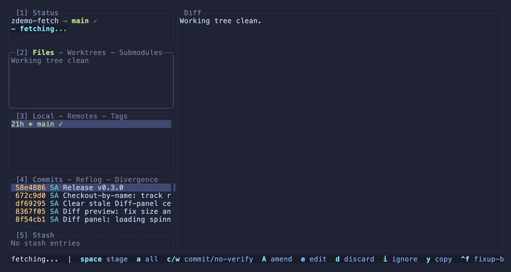
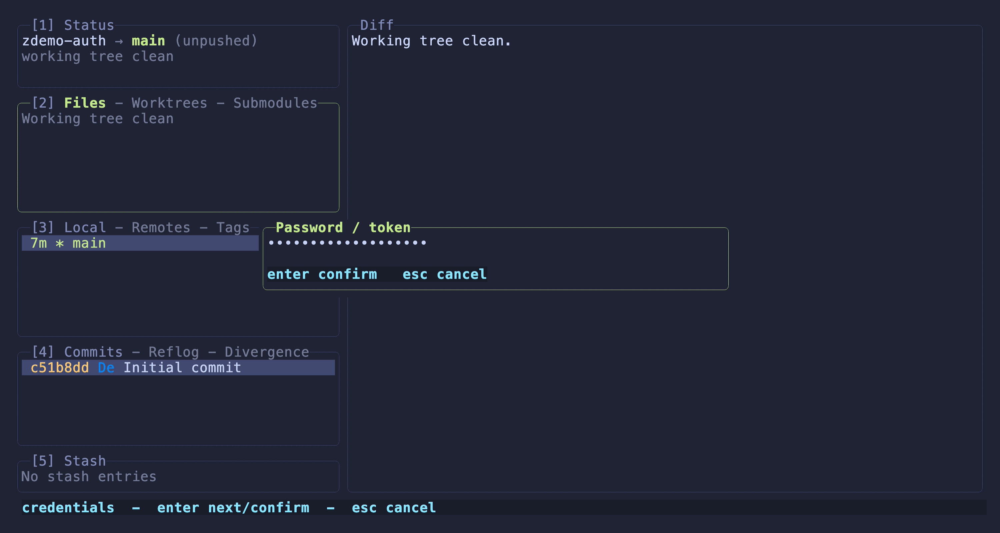
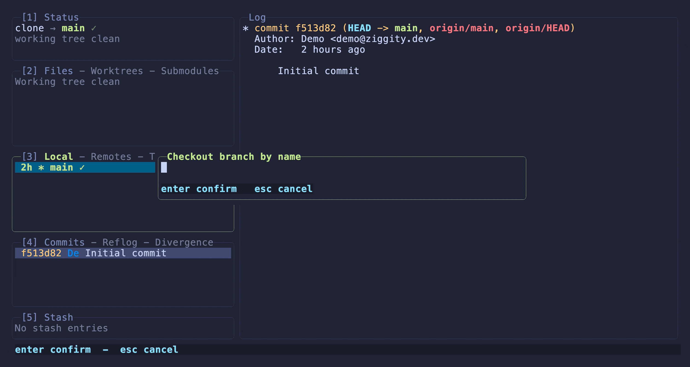
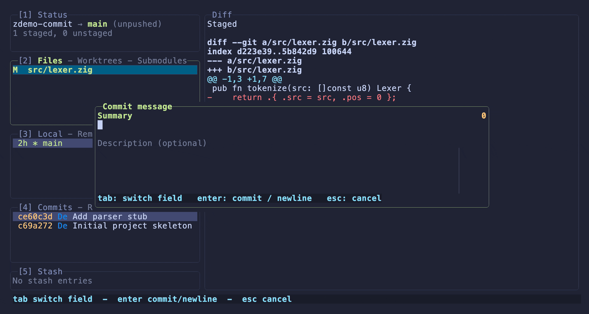
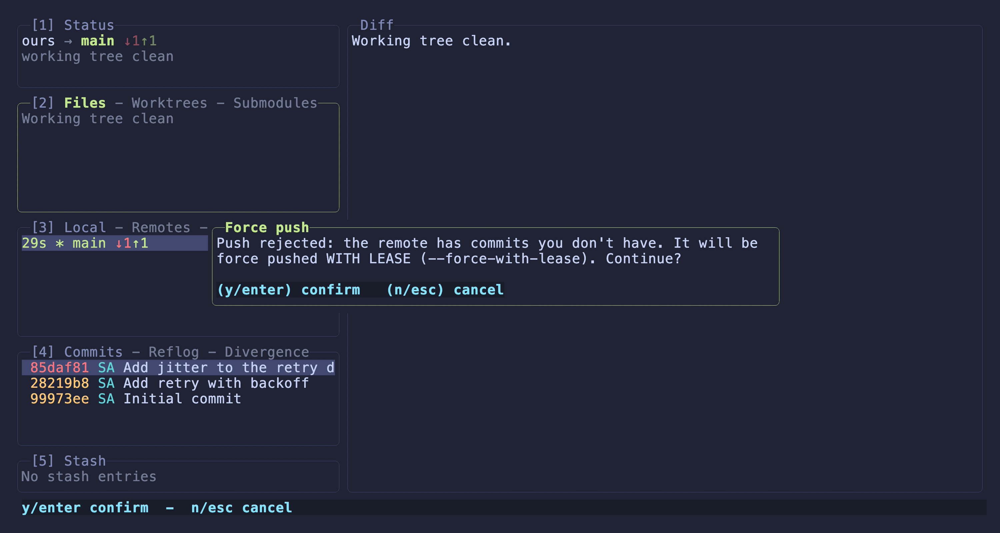
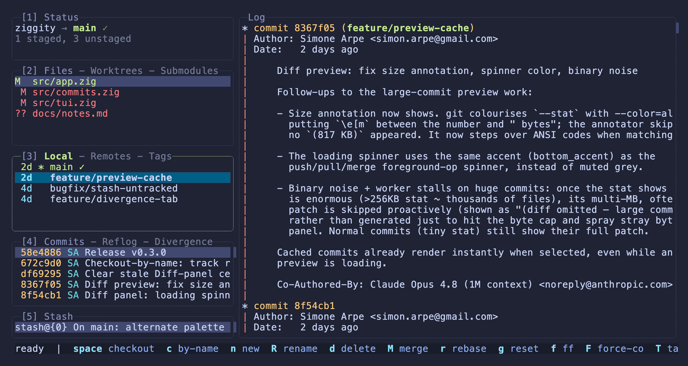
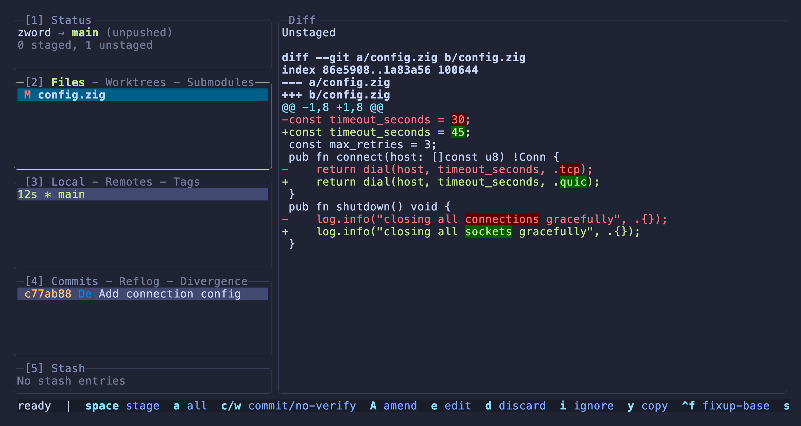
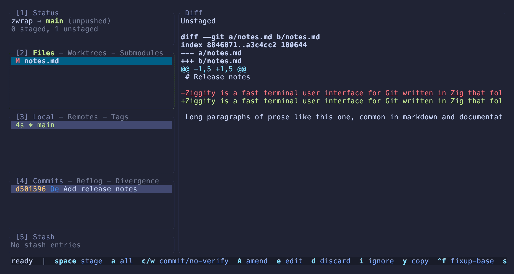
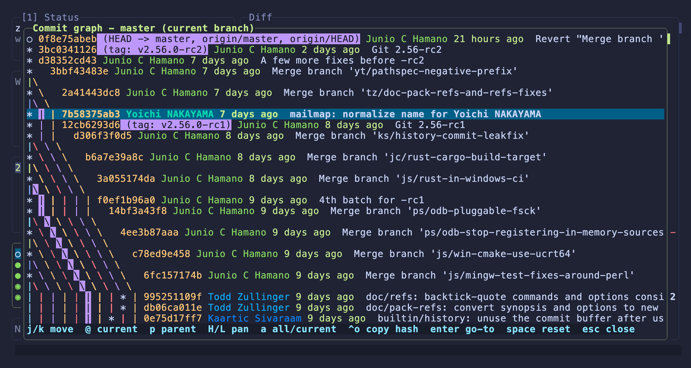
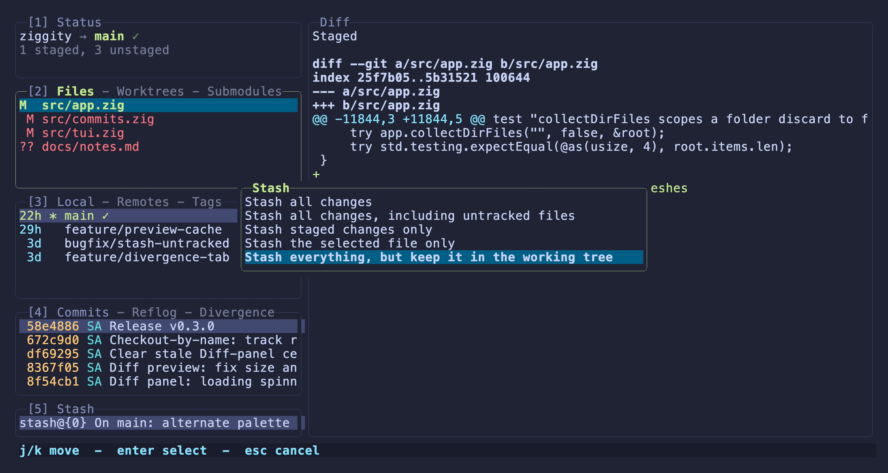

# Why Ziggity

The point by point case for Ziggity against
[lazygit](https://github.com/jesseduffield/lazygit), with measurements and
demos. The [README](../README.md) carries the summary; this page is the long
form. [ENHANCEMENTS_OVER_LAZYGIT.md](ENHANCEMENTS_OVER_LAZYGIT.md) tracks the
same list in short form.

If lazygit already works for you, great: it is an excellent tool. Ziggity
exists because a few everyday interactions could be quicker, more efficient,
or more predictable, and because Zig makes it possible to deliver that in a
tiny native binary. Here is the honest case, point by point.

## Small and Fast

Ziggity compiles to a single static binary with no runtime, no garbage
collector, and no library dependencies beyond the `git` you already have.
Measured on an Apple M1 Max running macOS 26.5.1, against lazygit 0.62.2 from
Homebrew, both opening the same repository (ziggity's own: 359 commits, 156
tracked files, 21 refs, a working checkout with build output on disk) at the
same terminal size:

| | ziggity 0.14.0-dev | lazygit 0.62.2 |
|---|---|---|
| Binary size | **1.9 MB** | 17.6 MB |
| Dynamic libraries linked | **1** | 4 |
| Process startup, median of 30 runs | **3.6 ms** | 21.2 ms |
| Git subprocesses to load the repo | **16** | 25 |
| Peak git processes running in parallel | **11** | 9 |
| Network during load | **none** | `git fetch --all` |
| Resident memory once settled | **8 MB** | 36 MB |
| Peak resident memory while loading | **8 MB** | 36 MB |
| Git subprocesses over 10 s idle | **22** | 40 |
| Own CPU time over 10 s | **40 ms** | 250 ms |
| Total CPU including git children | **0.48 s** | 0.73 s |

Startup is the time from spawn to exit for `--version`, the floor any launch
pays before real work begins. The git subprocess rows come from a shim on
`PATH` that timestamps every invocation and collects the child's CPU through
`wait4`, so both tools' startup bursts are on record rather than estimated.
Memory is resident set size, sampled every 5 ms while the repository loads and
every 100 ms after that; "settled" is the reading ten seconds in, once loading
has finished. CPU is split between the tool's own process and the git children
it spawns, because both tools do most of their real work inside git. Every row
is the median of seven runs. The whole
table comes out of one command, [`docs/bench`](bench/), so you can run the
same checks yourself rather than take these on trust. Numbers vary by machine
and by repository size; the shape does not.

Treat the CPU rows as approximate. They are the noisiest thing here: across
those seven runs lazygit's own CPU ranged from 240 ms to 280 ms and ziggity's
from 30 ms to 40 ms, and on a machine doing anything else both spread much
wider than that. The medians are steady and the gap is consistent, but a
single figure carries more precision than the measurement does. Resident
memory wanders by a megabyte or two between runs as well. Binary size, library
count, startup and peak parallelism are effectively constant.

The two memory rows say the same thing, which is the point of reporting both.
Ziggity holds about a fifth of lazygit's footprint and holds it from the first
paint: the eleven loaders allocate their results on a general purpose
allocator and hand them to the interface thread, so nothing balloons while the
load is in flight and peak and settled land within a rounding error of each
other. lazygit is flat too, at its own higher level. The comparison therefore
reads the same whether you care about the moment of launch or a window left
open all day.

The subprocess log also shows where the efficiency comes from. When Ziggity
opens a repository it fans out eleven loaders at once, one per concern:
status, working tree files, local branches, remote branches, remotes, tags,
worktrees, submodules, the commit log, the reflog, and the stash list. The
shim caught all eleven launched within seven milliseconds of each other, and
every panel had its data about a hundred milliseconds later. Each loader asks
git for machine readable output (`--porcelain -z`, `--format` with null
separators) and parses it in a single pass, no shell in between, no libgit2
state to synchronize. To be fair, lazygit parallelizes its refresh too; it
just takes about half again as many subprocesses to load the same repository,
keeps going at a higher rate once idle (40 git processes in ten seconds
against 22), and burns roughly six times the CPU in its own process over the
same window.

The network row is a scheduling difference, not an absolute one. lazygit runs
`git fetch --all` as part of loading the repository, in the same burst as
everything else, so the first paint waits on the network. Ziggity loads and
paints without touching it, then runs its first quiet background fetch about
three seconds later, off the interface thread; the timer is deliberately
seeded so you do not wait a full `fetch_interval_secs` for it. Both tools
fetch. Only one of them makes you wait for it before you can do anything.

After launch the same discipline holds. The commit log loads incrementally as
you scroll, so history is never capped and never loaded whole. Rendered
previews are cached, so reselecting a commit is instant instead of a fresh
`git show`. Background refreshes are scoped to what an operation could have
changed, so a big repository does not get a full `git status` storm every few
seconds. And everything slow runs off the interface thread, which is the next
section.

## Nothing Blocks, Ever

Fetch, pull and push run off the interface thread. A spinner ticks in the
Status panel, you keep navigating, and when the operation finishes you get a
one line summary. Success is silent; only failures open a dialog, and each
message can be easily copied.

<p align="center">
  
</p>

<p align="center"><i>A fetch in flight. The selection keeps moving; the spinner lives in the Status panel.</i></p>

At no point does Ziggity drop you back to the raw terminal to run git. If you
use lazygit, you know the "press enter to return to lazygit" screen it shows
after handing an operation to the terminal; Ziggity has no equivalent, because
nothing ever leaves the interface. Slow multistep actions (merge, rebase,
autosquash, bisect, patch apply) follow the same rule: they run in the
background while navigation stays live. The single intentional exception is
`e`, which opens the selected file in your default editor: a terminal editor
suspends the interface and resumes when you quit it, a GUI editor just
launches alongside.

Even authentication stays inside the app. When a push over HTTPS needs
credentials, Ziggity opens a username prompt and a masked token prompt right
there, feeds git through its normal askpass machinery, and retries. No
external helper required, no terminal takeover, and a configured keychain
still caches the result for next time. If the host rejects a password because
it wants a token, Ziggity says so instead of asking again in a loop.

<p align="center">
  
</p>

<p align="center"><i>An HTTPS remote asked for credentials. The token field masks as you type, and the fetch retries in place.</i></p>

## Copy Text Straight from the Screen

Terminal UIs usually make copying painful: the terminal's own selection grabs
the whole screen, panel borders included. Ziggity has real text selection
built in. Click and drag over the diff to select an exact span of characters;
release, and it is already on your clipboard.

- Works on whatever the main panel shows: a file diff, a commit, a branch
  log, a stash, the commit graph.
- The copied text is clean. Color codes are stripped, indentation survives,
  and multiline selections join with newlines.
- The same selection works in the read only dialogs: command output, the
  keybindings overlay, and the command log.
- Dragging does not steal focus from the panel you were in, so your place in
  the list is kept.

Copying uses OSC 52, the same mechanism as every other copy action in the
app, so it works over SSH too as long as the terminal supports it.

## The Mouse Works Everywhere

Ziggity is built for the keyboard, but the mouse is a first class citizen,
not an afterthought:

- Click any panel to focus it, click any row to select it.
- In the staging view, click a line to put the cursor on it, then stage it
  with `space`. No walking down hunk by hunk to reach one line.
- In the checkout prompt, click a suggestion to pick it.
- The wheel scrolls every list, the diff, dialogs and the commit graph, and
  the graph also supports click and drag.
- And as above, dragging over the diff or a dialog selects and copies text.

<p align="center">
  
</p>

<p align="center"><i>A live session in Ghostty, driven with the mouse: every click lands on a file or panel, the diff follows along, and the staging view opens in place.</i></p>

## At Home in Any Terminal

A tool like this lives or dies by terminal quirks, so Ziggity spends real
effort on compatibility. Colors stick to the standard ANSI palette and a
curated 256 color set, with emphasis done through dim and bold rather than
exotic indices, so the interface stays readable on a stock Terminal.app, a
Linux console, or a tricked out truecolor setup alike. Clipboard copy uses
OSC 52, so it survives SSH. Focus events pause animations and background
refreshes when the window loses focus. Bracketed paste keeps a pasted
multiline commit message from submitting early, and the kitty keyboard
protocol is used where available.

Ziggity is developed daily in [Ghostty](https://ghostty.org), where it works
fantastically. Every screenshot and gif in this page uses the TokyoNight
Moon palette from that setup, and the mouse demo above is a live recording
of it.

## Checkout by Name That Lands on a Real Branch

Type `c`, start typing any ref, pick from live suggestions, press enter. If
you name a remote branch, Ziggity checks it out with `--track`: you land on a
proper local branch with its upstream set, in one step.

<p align="center">
  
</p>

<p align="center"><i>Typing a remote branch name. One enter later: a local tracking branch, upstream set, never a detached HEAD.</i></p>

This is a spot where lazygit gets it wrong. As of today, typing a remote
branch name in its checkout prompt runs a plain checkout of that ref: you
land on the head commit in a detached state, no local branch, no tracking.
Ziggity does what you meant instead. A remote name tracks, an existing local
name switches, a tag or commit detaches because that is the only correct
meaning, and `-` returns to the previous branch.

## A Commit Editor That Nudges the 50/72 Rule

The commit dialog is a real editor with a subject line and a multiline body,
and it quietly teaches good commit hygiene. The subject shows a live
character count that turns red past 50. The body draws a soft guide column at
72 so wrapped lines have an obvious edge. Both thresholds are configurable,
including off.

<p align="center">
  
</p>

<p align="center"><i>The counter turns red as the subject passes 50 characters, and back to yellow once trimmed. The body shows its wrap guide at column 72.</i></p>

The dialog also runs your repository's `prepare-commit-msg` hook when it
opens, the way an interactive `git commit` would, and prefills the message
from its output. The common hook that derives a ticket prefix from the branch
name finally works from a TUI: those hooks usually guard on an empty source
argument, which a message flag never satisfies, so in other tools they
silently do nothing (lazygit issue
[#4995](https://github.com/jesseduffield/lazygit/issues/4995)). Drafts
survive too: close the dialog, come back later, your message is still there.

## AI Commit Messages, Your Own Model

The same dialog can draft the message from the staged diff: a subject line in
your recent style and a body that explains the change. It is optional and off
until you set it up, and it never takes over. Press `ctrl+g` to generate the
focused field and again to regenerate it. The subject targets your summary
limit and the body reflows to your wrap column, the same 50/72 conventions the
dialog already nudges. You can keep typing while it works, a generated result
never overwrites text you edited, and a failure is a small note in the field
rather than a blocker.

<p align="center">
  
</p>

<p align="center"><i><code>ctrl+g</code> drafts the subject from the staged diff, then the body to match, each with its own spinner while it works.</i></p>

The part that keeps ziggity small: it ships no model and calls no API of its
own. You point `ai_command` at a command that reads a prompt on standard input
and prints the completion on standard output, so the provider, model, key, and
subscription all live in that tool. The binary stays a tiny static download.

[pi](https://github.com/earendil-works/pi) is the one to reach for. It talks to
everything, the ChatGPT Plus, Claude Pro, and Copilot subscriptions included, so
you use what you already pay for with no per-token bill. Want something
different? [`llm`](https://github.com/simonw/llm) drives any provider you hold an
API key for. Want it fully local? [`ollama run <model>`](https://github.com/ollama/ollama)
keeps it on your machine. Nothing is baked into ziggity either way.

lazygit has no built-in commit message drafting; you would bolt an external
tool on through a custom command, without the in-dialog per-field generation,
the spinners, or the guarantee that a result never clobbers what you typed.

## A Force Push That Never Dead Ends

When a push is rejected because the remote moved, what happens next should
not depend on hidden state. Ziggity walks one predictable ladder, confirming
each step:

```
git push
  rejected: confirm, then git push --force-with-lease
    rejected again (stale lease): confirm, then git push --force
      still failing: report the error and stop
```

<p align="center">
  
</p>

<p align="center"><i>The remote moved, the push was rejected, and the first rung of the ladder asks before running. Note the diverged arrows and the red unpushed hash.</i></p>

The safe force always comes before the blunt one, there is no "you must pull
first" dead end, and the chain never loops. Rejections are recognized from
git's own messages; unrelated failures such as authentication or network
errors surface as normal errors with no force offer. Either confirmation can
be turned into an auto accept in config, and both default to asking.

For comparison, lazygit's behavior depends on whether the remote tracking
ref happens to be stored locally: sometimes you get the lease force,
sometimes a plain force, and sometimes only advice to pull first.

## Diffs the Way Review Tools Show Them

Comparing two refs is one keystroke: press `W` on any branch or commit and it
becomes the diff base. A short note explains what just happened and how to
leave, the marked row keeps a colored diamond while you navigate, and the
Diff title tracks every move in git's own notation with the real ref names:
`main..58e4886a`, `main...feature/login`. The order around the dots is the
direction, the dot count is the mode, so the whole state is always readable
off the screen. In lazygit the same feature opens a menu first and then keeps
its state in your head: no marker on the marked ref, no indication of what is
being compared against what.

<p align="center">
  
</p>

<p align="center"><i>One W marks the branch and explains itself. The diamond stays on the base; the title follows the selection with real ref names.</i></p>

The dot count matters because the two views answer different questions.
`base..selected` is the full difference between the two snapshots.
`base...selected` diffs from the merge base: only the selected side's own
changes since the histories diverged, which is what every pull request page
shows, and what you actually want after merging `master` into your branch,
when a plain two dot diff drowns you in changes that are not yours. That
merge base view was requested in lazygit as issue
[#3767](https://github.com/jesseduffield/lazygit/issues/3767) and is still
open there. Ziggity not only has it, it defaults to it whenever the marked
base is a branch, while commits and tags default to the plain two dot
comparison, because comparing snapshots is usually what those mean. Press `W`
again for the options: invert the direction, switch the dots, type an
arbitrary ref, or exit.

## Word-Level Diff Highlighting

When a line changes, Ziggity does not just paint the whole old line red and the
whole new line green and leave you to spot the difference. It compares the two
lines word by word and gives only the parts that actually changed a stronger
background, a dark red behind removed words and a dark green behind added ones,
the way delta, GitHub and VS Code do. Change `30` to `45` on a long line and
just `30` and `45` light up over the normal line color. The two-line `-`/`+`
layout stays, so nothing is lost, but your eye goes straight to what moved.
lazygit colors whole lines only. It is on by default (`highlight_word_diff`),
and the two backgrounds are themeable (`word_add_bg`, `word_del_bg`).



## Wrap Long Lines On Demand

Code lines are short, so by default the diff panels truncate anything past the
right edge and `H`/`L` pan across it. Prose is the opposite: a markdown or
documentation paragraph is one very long line, and the word that changed can sit
off screen, invisible, until you scroll sideways to hunt for it. Press `ctrl+w`
and every diff panel soft-wraps to the view width instead, so the whole
paragraph, and the change inside it, is right there. The word-level highlight
travels onto the wrapped rows, correctly aligned through wide characters, emoji
and tabs. Wrapping is session-wide and toggles instantly; it starts off and can
default on with `wrap_diff = true`. While it is on the Diff panel title shows a
`↩ wrap` marker, so the current state is always visible.

<p align="center">
  
</p>

<p align="center"><i>The same prose diff, truncated then wrapped with ctrl+w. The changed word was off screen; now it is not, and it keeps its highlight.</i></p>

This is the one place lazygit and Ziggity agree it matters: lazygit wraps its
staging view by default for exactly this reason. Ziggity extends it to every
diff panel (preview, staging, fullscreen) behind one toggle.

## History Navigation with Intent

The commit graph (`ctrl+l`) is the real `git log --graph`, in git's own
colors, loaded off the interface thread. By default it shows your branch and
its upstream, so incoming commits are visible immediately; `a` widens to all
branches. `@` jumps to HEAD. And `p` jumps to the current commit's first
parent, which turns a merge heavy history into something you can walk
mainline first (requested in lazygit as
[#3974](https://github.com/jesseduffield/lazygit/issues/3974)). The parent
map is loaded alongside the graph, so the jump is a pure memory lookup.

<p align="center">
  
</p>

<p align="center"><i>A merge heavy history (git's own repository): parallel lanes, merges, and per author colors, exactly as git draws them.</i></p>

The Commits panel adds a Divergence tab: your branch versus its upstream,
outgoing commits grouped above incoming ones, with history editing keys
disabled there so you cannot accidentally rebase what you have not pulled.
Commit hashes are tinted by push state everywhere, red for commits that have
not left your machine, so "safe to rewrite" is visible at a glance.

## Two Histories Side by Side

The Branches panel drills into any branch's commits, and those commits'
files, independently of the Commits panel. Both keep their own selection at
the same time, so you can hold your place in the main log while you inspect
a colleague's branch. In lazygit the commit view is one shared panel tied to
the checked out branch, so inspecting another branch means losing your spot.
Diffing mode understands the drill too: the marked ref is the commit you are
actually on, not the branch that contains it.

## Jump Between Repositories

`ctrl+r` opens the recent repositories switcher: a list of every repo you have
opened in ziggity, most recent first, each row aligned as name, current branch,
and path. Pick one with `enter` and ziggity re-roots in place, no restart and
no second process. The list lives in a plain text file under the XDG state
directory (`~/.local/state/ziggity/recent`), one path per line, safe to read or
edit by hand.

Navigate with `j` and `k` or the mouse wheel, and pan long paths left and right
with `H` and `L`. Click a row to highlight it, or drag to select and copy text;
switching always happens on `enter`. If a listed repo has since been moved or
deleted, picking it asks whether to drop it from the list (nothing on disk is
touched). Remove the highlighted entry at any time with `d`; removing the last
one just closes the switcher.

<p align="center">
  
</p>

<p align="center"><i>ctrl+r lists the repos you have opened, aligned as name, branch and path. Enter switches in place; the current repo is left out.</i></p>

## Stash Without Losing Your Working Tree

The stash menu has the variant that other tools skip: snapshot everything
into a stash entry, untracked files included, while your working tree stays
exactly as it is. Nothing disappears from your editor, no half staged state
gets shuffled, and the snapshot sits in the stash list as a restore point.
It is the cheapest insurance there is before a risky refactor, and it doubles
as a way to hand a work in progress to someone else (`w` exports any stash as
a `git apply` ready patch) without interrupting your own flow.

<p align="center">
  
</p>

<p align="center"><i>The stash menu over a tree with staged, unstaged and untracked changes. The highlighted variant records all of it and touches none of it.</i></p>

Getting this right takes more than a flag. Git's own plumbing for it,
`git stash create`, silently ignores untracked files, so a naive
implementation records less than it claims. Ziggity stashes everything with
`--include-untracked` and immediately reapplies it with `--index`, so the
stash entry is complete and the working tree, including the staged and
unstaged split, comes back byte for byte.

## Small Courtesies

- One remote means no remote menu: pushing a tag in a single remote
  repository just pushes it. The prompt only appears when there is a real
  choice, prefilled with the suggestion.
- The stash menu covers the rest of the real cases too: everything,
  everything plus untracked, staged only, or a single file, each with an
  optional name.
- Commit subjects highlight
  [Conventional Commits](https://www.conventionalcommits.org/) prefixes: the
  type in accent, the scope muted, a breaking `!` in red
  (`highlight_conventional_commits`). And in the rebase plan editor every row
  carries its pending action label (pick, drop, squash, fixup, edit), so a
  plan reads at a glance before it runs.
- A commit that imports half a toolchain (thousands of files, gigabytes of
  binaries) previews instantly: the message and file list always load, and
  the unreadable patch is omitted instead of freezing the panel.
- Mistyped an HTTPS password? The error tells you the host wants a token
  instead of silently reprompting forever.
- `ctrl+z` undoes the last operation through the reflog, after confirmation.
  Undoing a commit or an amend brings the changes back staged rather than
  discarding them; other operations restore their prior state.

The remaining parity gaps are listed under
[Status & Roadmap](../README.md#status--roadmap) in the README.
