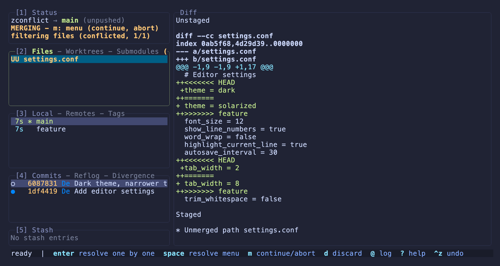
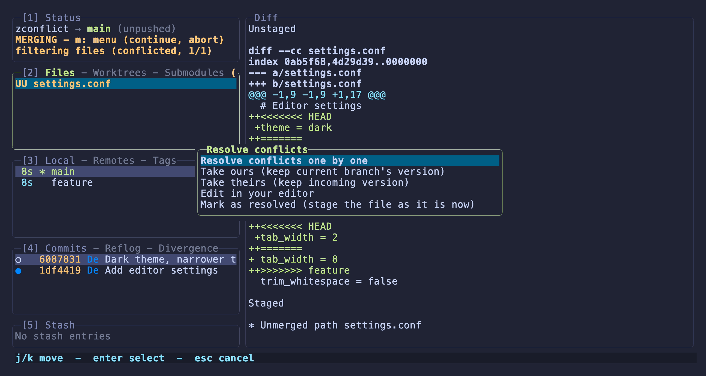
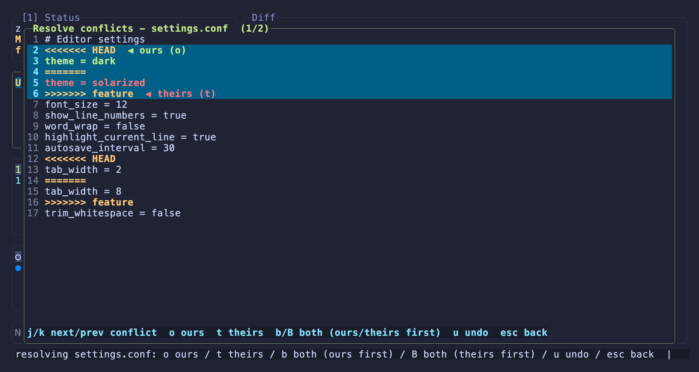

# Resolving merge conflicts

When a merge, rebase, or cherry-pick stops on a conflict, you resolve it inside
Ziggity, with no need to drop to the shell. The Status panel shows `MERGING`
(or `REBASING`, `CHERRY-PICKING`), the Files panel filters down to the
conflicted files, and every route to a resolution is a keystroke away.

## Where to start

A conflicted file shows a `UU` status in the Files panel. The footer lists the
two ways in, plus how to finish or back out:

- **`enter`** opens the per-conflict resolver on the selected file (see below).
- **`space`** opens the resolve menu with every route at once.
- **`m`** opens the operation menu: continue once everything is resolved, or
  abort the whole merge or rebase.
- **`d`** discards the file.

Continue (`m`) is refused with a hint until every conflicted file is resolved
and staged, so you never hit git's raw "you have unmerged files" error.

## The resolve menu

`space` on a conflicted file opens the **Resolve conflicts** menu:

- **Resolve conflicts one by one** opens the per-conflict resolver (same as
  `enter`).
- **Take ours** keeps the current branch's version of the whole file.
- **Take theirs** keeps the incoming version of the whole file.
- **Edit in your editor** opens the file in your configured editor. When it
  closes, Ziggity re-reads the file and, if the conflict markers are gone,
  stages it as resolved automatically. If markers remain, the file stays
  conflicted and every option is still available.
- **Mark as resolved** stages a file you already fixed by hand. It refuses,
  with a hint, while conflict markers remain, so a half-merged file is never
  staged by accident.

## Resolving block by block

`enter` (or "Resolve conflicts one by one") opens the resolver. It walks the
file one conflict at a time, with the current block highlighted:

The title counts the conflicts (`1/2` here). The selected block tints **ours
green** and **theirs red**, and labels each side on its marker, so you never
have to remember that `<<<<<<< HEAD` is ours and the incoming branch is theirs.

### Keys

| Key | Action |
| --- | --- |
| `j` / `k` | Move to the next / previous conflict block |
| `o` | Keep **ours** for this block |
| `t` | Keep **theirs** for this block |
| `b` | Keep **both**, ours first |
| `B` | Keep **both**, theirs first |
| `u` | Undo the last pick |
| `esc` | Leave the resolver |

Once the last conflict in the file is resolved, the file is staged
automatically and you return to the Files panel.

### Ours, theirs, and both

`o` and `t` keep one side of the block. `b` and `B` keep both, in the order the
key names: `b` puts ours above theirs, `B` puts theirs above ours. That covers
the common case where you want to combine both changes without opening an
editor, and the order matters. For anything more intricate than "both, in some
order", use **Edit in your editor** and hand-merge the block.

## Resolving by hand

You can always resolve a file yourself, either with **Edit in your editor** or
in a separate terminal. Either way, once the conflict markers are gone Ziggity
recognizes the file as resolved: the editor flow stages it on exit, and for an
external edit, **Mark as resolved** (or pressing `enter` on the now marker-free
file) stages it.

## Finishing

When every conflicted file is resolved and staged, press `m` from any panel and
choose **Continue** to complete the merge or rebase. The same menu offers
**Abort** to return to the state before it started.
