# Features

The full feature reference. The [README](../README.md) carries the summary.
See also [keybindings.md](keybindings.md) for every key and
[configuration.md](configuration.md) for the settings each feature reads.

## Screenshots

A visual tour of the main features. Aside from the live mouse recording in
[comparison.md](comparison.md#the-mouse-works-everywhere), every image is
generated from a scripted session (the tapes live in [`assets`](assets))
against real repositories, in the TokyoNight Moon palette, at one shared
resolution.

### Staging by Hunk and Line

`enter` a file to open the staging view. Stage or unstage single lines or
whole hunks (`space`), with an optional split showing both sides at once.
Press `d` to discard instead of stage: it uses the same selection as `space`,
so `d` on a line throws that line away and `d` on a `@@` header throws away the
whole hunk. On the staged side `d` drops the change from the index as well, so
it is gone for good.

### Commits & History

The Commits panel previews each commit's diff, including its GPG signature
status; `enter` opens the commit's changed files.

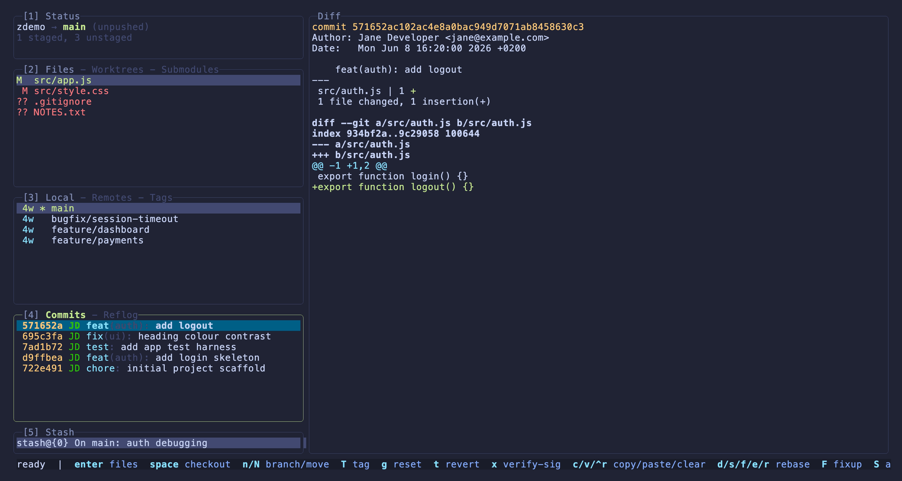

`ctrl+l` opens the real `git log --graph` DAG in git's own colors. By default
it shows the current branch **and its upstream**, so the commits you are
behind by are visible right away; `a` toggles all branches. Jump to HEAD with
`@`, or to a commit's first parent with `p`. `space` resets the current branch
to the commit under the cursor (soft / mixed / hard) — handy for rewinding to
the last merge; the hint only appears for a commit on the current branch, since
that is the only valid `git reset` target.

Full interactive rebase: press `i` on a commit to open a plan editor, mark
`pick` / `drop` / `squash` / `fixup` / `edit`, reorder with `ctrl+j` and
`ctrl+k`, then run it.

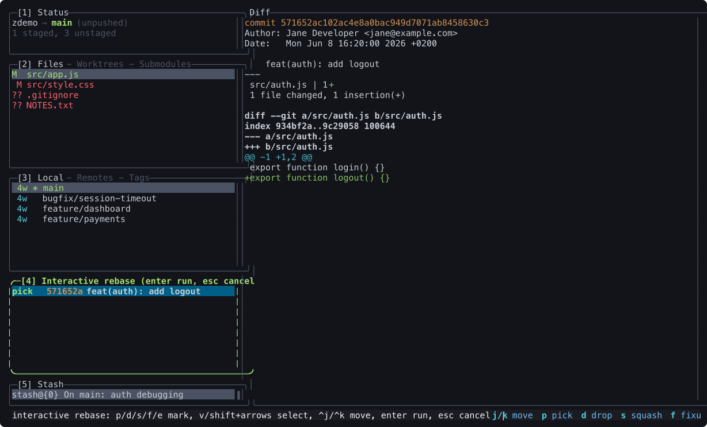

### Committing

`c` opens the commit dialog: a summary line plus an optional multiline body,
a live character count nudging the 50/72 rule, and optionally a
`prepare-commit-msg` hook prefill.

### Branches & Tags

The Branches panel shows ahead and behind arrows, upstream tracking and per
ref actions (merge, rebase, reset, checkout, and more); the Tags tab lists
tags with their messages.

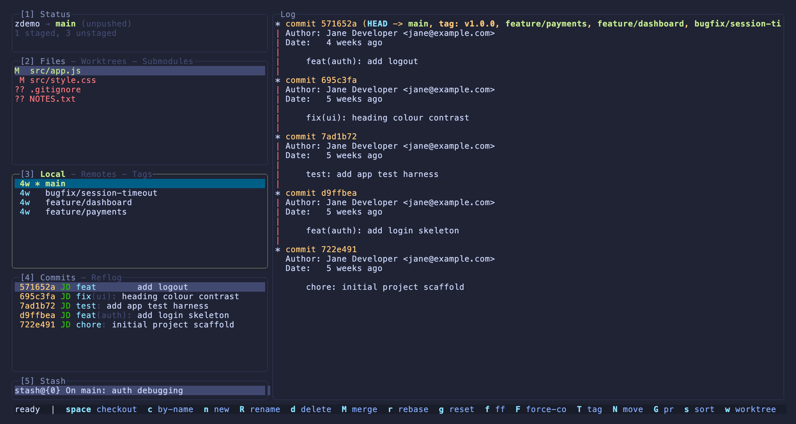

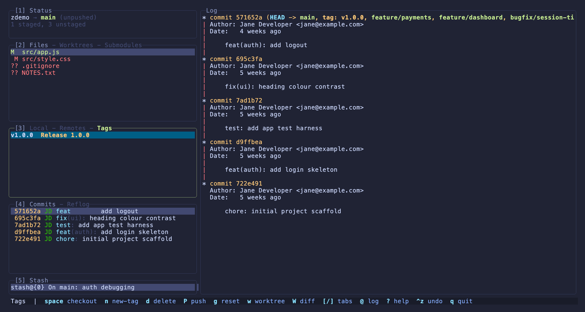

### Stash

A Stash panel with a diff preview. The stash menu (`s`) offers every variant
(all, plus untracked, staged only, a single file, keep the working tree),
each with an optional message, and `w` writes any stash to a `git apply`
ready patch file.

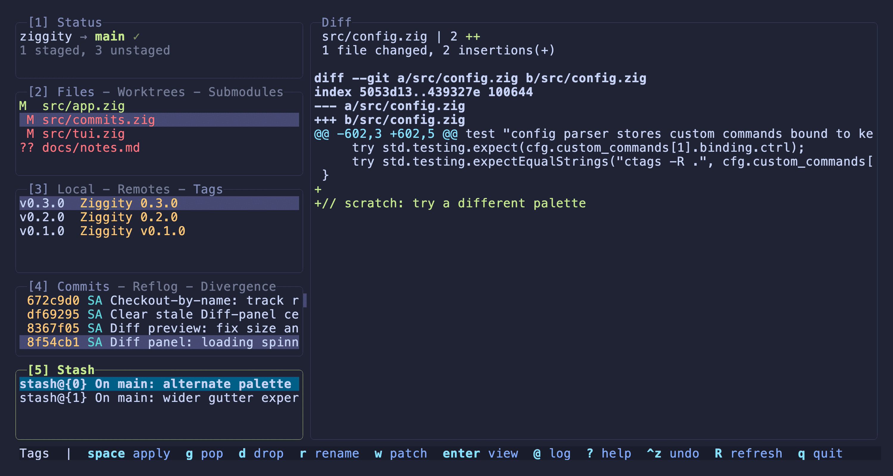

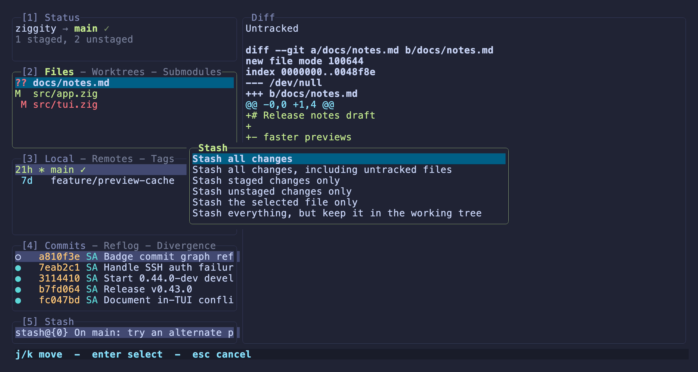

### Diffing & Menus

Mark any ref and diff another against it (`W`), with reverse and merge base
options. Destructive actions route through clear, explicit menus.

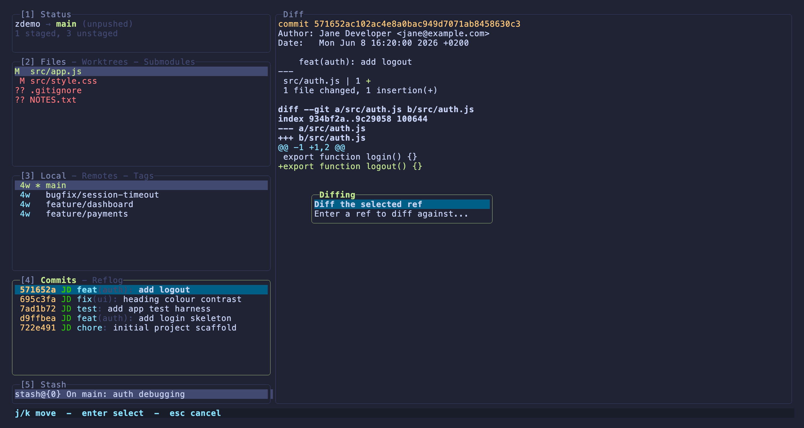

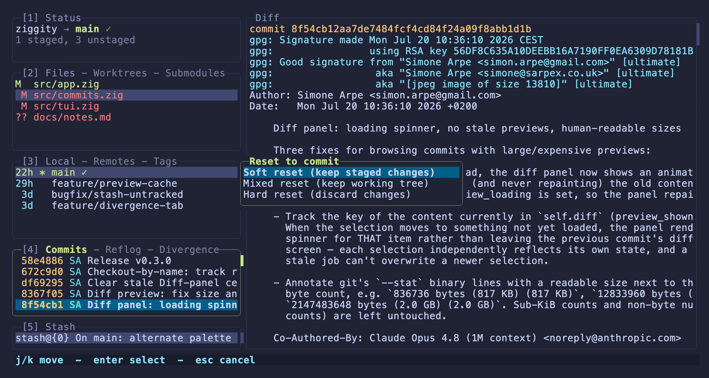

### Recent Repositories

`ctrl+r` opens the recent repositories switcher: every repo you have opened
before, aligned as name, branch, and path. `j` and `k` or the wheel move the
highlight, `H` and `L` pan long paths, `enter` switches in place, and `d`
removes an entry.

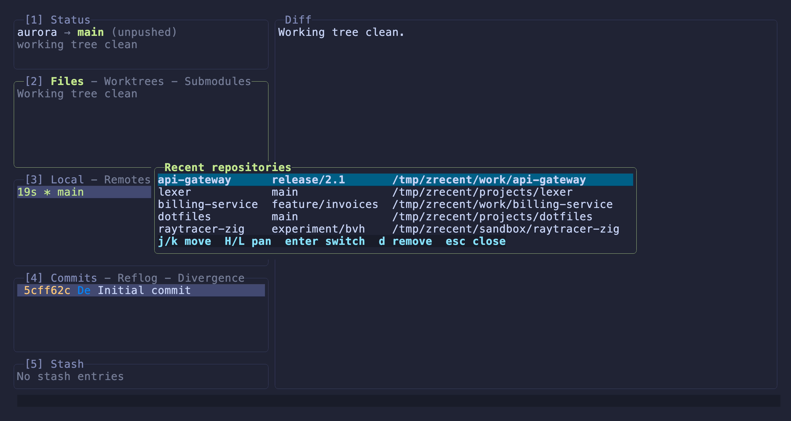

### Help & the About Screen

`?` opens the keybindings overlay, scrolled to the panel you are on.
Selecting the Status panel shows an about screen with a live animation.

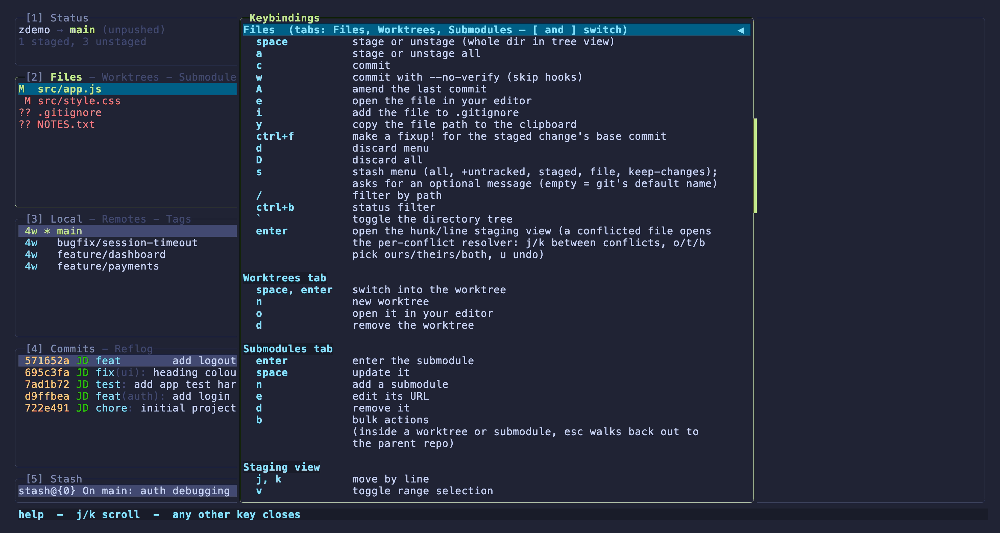

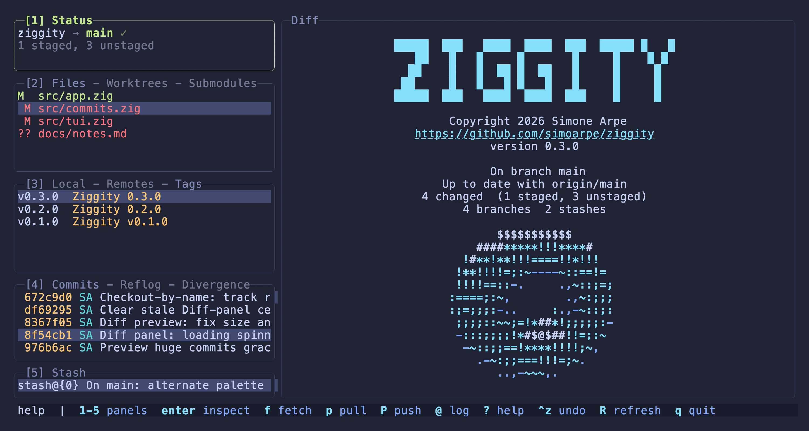

The animation itself is in the [README](../README.md).

## Full feature list

### Working tree & staging

- Files panel from `git status --porcelain -z`; stage or unstage a file
  (`space`) or everything (`a`).
- Staging by hunk and line: `enter` opens a staging view to stage or unstage
  single lines (`v` for a range) or whole hunks (`tab` switches the unstaged
  and staged sides; `\` toggles the split view, see
  [Staging layout](configuration.md#staging-layout-staging_split)). `d`
  discards the selected line(s) or hunk instead of staging them.
- Directory tree view (`` ` ``) for working tree files **and** a commit's or
  branch's file list: a `/` root, collapsible folders (`enter`), single child
  chains compressed to `a/b/c`. Selecting a folder shows the combined diff
  beneath it; in the Files panel `space` stages the whole folder. Set
  `show_file_tree = true` to start in tree mode on every launch.
- Live fuzzy path filtering (smart case subsequence) with recent filter
  recall, plus a status filter (staged, unstaged, tracked, untracked).
- Discard a file, or a whole folder in tree view (`d` on a directory), via a
  menu (all, or unstaged only), or discard everything (`D`, confirmed). Ignore
  or exclude a file (`i`): a menu adds it to the shared, committed `.gitignore`
  or the local, uncommitted `.git/info/exclude`. Copy a path (`y`).
- Scoped periodic refresh for external changes, plus a full refresh when the
  terminal regains focus.

### Branches, tags & remotes

- Branches panel from `git branch --format`: a "time ago" column, per branch
  tracking status (`✓` in sync, `↑` and `↓` for ahead and behind, `(gone)`),
  and the upstream ref shown only when it is not the obvious
  `origin/<same name>`.
- Branch actions (Local tab): new (`n`), rename (`R`), delete (`d`), merge
  (`M`), rebase (`r`), fast forward (`f`), checkout by name (`c`), reset
  (`g`), force checkout (`F`), tag (`T`), move commits to a new branch (`N`),
  open the pull request (`G`, the branch's own PR/MR if it has one, else the
  create page), sort menu (`s`).
- Pull/merge request status per branch: after the sync status, each local
  branch shows its PR/MR as a state coloured `#<number> - <State>` (green Open,
  yellow Draft, purple Merged, red Closed). Fork PRs are ignored so they never
  false-match a same-named local branch. Fetched in the background via the host
  CLI (`gh` for GitHub, `glab` for GitLab), which already hold your auth, so no
  token is stored. On by
  default and silent when the tool is absent, the host is unsupported, or you
  are not logged in; disable with `pr_status = false`.
- Tags tab: checkout (`space`, detached), create (`n`, lightweight or
  annotated; overwrite prompts for `--force`), push to a remote (`P`), reset
  onto it (`g`), delete (`d`, local, remote, or both). One remote skips the
  remote prompt.
- Remotes tab: list remotes, drill into a remote's branches, add (`n`), edit
  URL (`e`), remove (`x`), set the current branch's upstream (`u`), delete a
  remote branch (`d`).
- Worktrees and Submodules tabs (Files panel): list, create or add, open,
  update, remove, a submodule bulk menu (`b`), and **switching repositories
  in place**: `space` or `enter` on a worktree (or `enter` on a submodule)
  reroots the app onto it, with a `parent / current` breadcrumb and `esc` to
  walk back out.

### Commits & history

- Recent commits from `git log`, loaded incrementally (the log grows as you
  scroll toward the end, so it is never capped), each row showing the
  author's initials in a stable per author color and a highlighted
  [Conventional Commits](https://www.conventionalcommits.org/) prefix (type
  in accent, scope muted, breaking `!` in red;
  `highlight_conventional_commits`). The short hash is tinted by push state:
  **red** for commits not yet on the remote, the usual yellow once pushed.
- Three tabs (`[` and `]` to switch): **Commits**, a **Reflog** recovery view
  (checkout `space`, reset HEAD `g`, branch `n`), and a **Divergence** view
  of the current branch versus its upstream, with `↑` outgoing commits
  grouped above `↓` incoming ones. The Divergence tab is read only: checkout,
  branch off, copy, paste and diff work; history editing keys are disabled.
- Commit (`c`), commit `--no-verify` (`w`), amend (`A`) in a centered editor
  with a summary line and optional multiline body (`tab` switches fields).
  The editor nudges you toward the
  [50/72 rule](https://dev.to/noelworden/improving-your-commit-message-with-the-50-72-rule-3g79):
  the summary shows a live character count (yellow, turning red once it
  exceeds `commit_summary_limit`, default 50), and the description shows a
  soft vertical guide at the body wrap column (`commit_body_guide`, default
  72, `0` off). When the editor opens, the repo's `prepare-commit-msg` hook
  runs (as it would for an interactive commit) and prefills the fields,
  editable before you commit (`prepare_commit_msg_hook = true`, disable to
  skip it). An unfinished message is not lost: if you cancel the editor **or
  the commit fails** (a rejecting `pre-commit` hook, a signing error, nothing
  staged), the draft is kept and restored the next time you press `c`, and it
  even survives quitting (persisted under `.git`). It is cleared only once a
  commit actually lands.
- Per commit: reset (`g`, soft, mixed or hard), revert (`t`), checkout
  (`space`, detached), branch from it (`n`), move commits to a new branch
  (`N`), tag (`T`), change author (`a`), and a copy menu (`y`: hash, subject,
  author).
- GPG signatures: a signed commit's diff shows git's verification block
  (`--show-signature`), and `x` verifies the selected commit's signature on
  demand (result in a dialog), with no per row cost.
- A navigable changed file list per commit (`enter`); `d` there discards a
  file's changes from that commit (rebase plus amend).
- Commit graph viewer (`ctrl+l`): the real `git log --graph` DAG in git's
  colors, loaded off the interface thread. The default view shows the current
  branch and its upstream (so incoming commits are visible); `a` toggles all
  branches. `@` jumps to HEAD, `p` to the first parent, `enter` jumps the
  selection; mouse scroll, drag and click supported.
- Log filtering (`/`): by message (`--grep`), author, or path; persists
  across refreshes and shows in the panel title.
- Bisect (`b`): mark the selected commit good or bad, then keep marking
  until the first bad commit is found.

### Interactive rebase & patches

- Per commit interactive rebase: drop (`d`), squash (`s`), fixup (`f`), edit
  (`e`), reword (`r`), move (`ctrl+j` and `ctrl+k`), create a `fixup!` (`F`),
  autosquash (`S`).
- Rebase plan editor (`i`): compose a plan for the commits down to the
  selected one, mark each action (with range select to mark or reorder many
  at once), then run it as one rebase.
- Cherry picking: copy commits to a clipboard (`c`), paste onto HEAD (`V`),
  clear (`C`).
- Custom patch building (`ctrl+p`): toggle files into a patch (`space` in a
  commit's file list), then apply it to the working tree (forward or
  reverse), remove it from its source commit, or reset it.
- `rebase --onto` from a marked base (`B`), and mid rebase amend (`m` can
  amend the stopped `edit` commit and continue).
- Conflict resolution: `enter` on a conflicted file opens a per conflict
  resolver with line numbers. `j` and `k` walk between conflicts, `o`, `t`
  and `b` keep ours, theirs or both for the current one, `u` undoes the last
  pick, and the file is staged automatically once the last conflict is
  resolved. `m` still offers the whole operation continue and abort actions;
  `MERGING` or `REBASING` shows in the Status panel.

### Multi selection, diffing & stash

- **Range select** in any list: `v` toggles a sticky range, `shift+arrows`
  extend one, `*` (Commits) selects every commit unique to the branch. The
  action key then applies to the whole range: stage, discard or edit files,
  drop, squash, fixup, edit, move, revert or copy commits, delete branches or
  tags, drop stashes, toggle commit files into a patch, or discard files from
  a commit.
- Diffing mode (`W`): press `W` on a commit or branch to mark it as the base
  (the row keeps a colored diamond marker and an explanatory note opens),
  select another ref, and the main panel shows `git diff` between the two.
  `W` again opens the options: invert the direction, switch the dots, enter
  an arbitrary ref, or exit. The Diff title always shows the live state in
  git's own notation with the real ref names (`main...feature/login`, with a
  full SHA shortened to its short hash): `base..selected` is the full two
  dot difference, `base...selected` the three dot view (only the selected
  side's changes since the refs diverged, what a pull request shows), and
  inverting swaps the order around the dots. Branch bases default to three
  dots, commit and tag bases to two.
- Stash menu (`s`): stash all, all plus untracked, staged only, just the
  selected file, or keep everything (snapshot into a stash, untracked files
  included, while leaving the working tree untouched). Each asks for an
  optional message (empty = git's default `WIP on ...` name). Apply, pop,
  drop, rename (`r`), or write to a patch file (`w`, producing
  `stash-<n>.patch`, untracked included, `git apply` ready) on the Stash
  panel.

### UX & quality of life

- **Calm feedback:** fast actions succeed silently with a one line summary;
  only failures pop a dialog. Slow multistep actions (merge, rebase,
  autosquash, patch apply, fast forward, bisect) and network operations
  (fetch, pull, push) run off the interface thread with a spinner while
  navigation stays live. Tunable via `result_dialog` and `command_output`.
- **Fetch, pull and push that never block** (`f`, `p`, `P`) with a status
  indicator.
- **Credential entry in the app:** on an HTTPS auth failure, a username plus
  masked token prompt feeds git for the session. No external helper needed,
  and a stale keychain entry cannot shadow what you type.
- Safe undo of the last operation (`ctrl+z`, reflog reset after
  confirmation); undoing a commit or amend keeps the changes staged instead
  of losing them.
- Recent repositories switcher (`ctrl+r`): jump to another repo you have
  opened before, without restarting (see
  [comparison.md](comparison.md#jump-between-repositories)).
- Find the fixup base for a staged change and make a `fixup!` (`ctrl+f`, via
  blame).
- Mouse text selection with automatic copy in the diff panel and the read
  only dialogs (OSC 52); copy a hash, branch or tag (`ctrl+o`); open a commit
  or branch on its remote host (`o`), with the right URL shape for GitHub,
  GitLab and Codeberg.
- Terminal integration: bracketed paste, so a pasted multiline commit message
  never submits early; focus events, which pause animations and background
  refreshes when the window loses focus; and the kitty keyboard protocol
  where available. Colors stay within the standard ANSI palette and a curated
  256 color set, so the interface is readable on a stock terminal as well as
  a truecolor one (see
  [comparison.md](comparison.md#at-home-in-any-terminal)).
- Command log overlay (`@`), themeable colors, fully remappable keys, and
  user defined custom commands.
