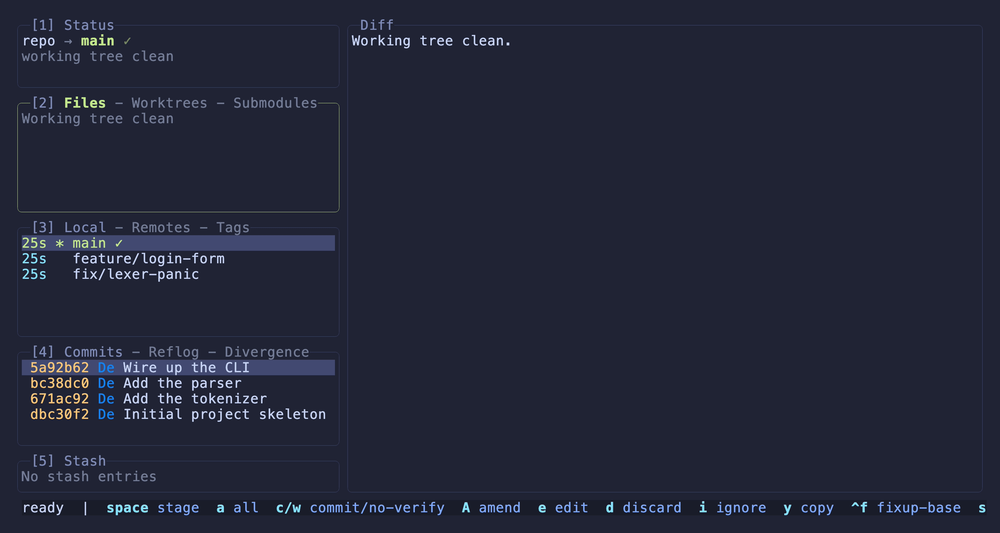

# Keybindings

Press **`?`** in the app for the full, always current overlay. This page is
the written reference. Every binding is remappable, see
[configuration.md](configuration.md).

## The essentials

| Key | Action |
|---|---|
| `1`–`5` | Focus Status / Files / Branches / Commits / Stash (press again to cycle that panel's tabs) |
| `h` `l` / arrows | Move focus between side panels |
| `j` `k` / arrows | Move selection |
| `tab` | Focus the Diff panel (and back) |
| `z` | Maximize the Diff panel to full screen (`z` or `esc` to exit) |
| `[` `]` | Switch the focused panel's tabs (or staging side) |
| `enter` / `esc` | Inspect in the main panel / step back |
| `space` | Stage file · checkout branch · apply stash (by focus) |
| `c` · `a` · `d` · `D` | Commit · stage all · discard menu · discard all |
| `v` · `shift+arrows` · `*` | Start range · extend range · select branch commits |
| `i` · `ctrl+p` · `ctrl+l` | Rebase plan · custom patch · commit graph |
| `f` · `p` · `P` | Fetch · pull · push |
| `ctrl+z` · `@` · `?` · `q` | Undo · command log · help · quit |

## Full keybinding reference

- `q` / `ctrl+c`: quit
- `R`: refresh
- `?`: keybindings help overlay (`j` and `k` to scroll), opened to the
  section for the current panel
- `ctrl+z`: undo the last operation (reflog reset, after confirmation)
- `ctrl+r`: switch to a recently opened repository (see
  [comparison.md](comparison.md#jump-between-repositories))
- `ctrl+w`: toggle soft-wrapping of long lines in the diff panels (see
  [comparison.md](comparison.md#wrap-long-lines-on-demand))
- `@`: command log (recent git commands ziggity ran)
- `ctrl+o`: copy the selected hash, branch or tag to the system clipboard
- `o`: open the selected commit or branch on its remote host in the browser
  (GitHub, GitLab and Codeberg URL styles are handled)
- `W`: diffing mode. Marks the selected ref as the base; select another to
  diff, `W` again for options (invert, switch the dots, arbitrary ref, exit;
  esc also exits)
- mouse: click a panel to focus; wheel to navigate and scroll; drag over the
  diff or a dialog to select and copy text
- `/`: filter files by path live; enter accepts; esc clears
- `` ` ``: toggle the directory tree view, in the Files panel **and** in a
  commit's or branch's file list. `enter` collapses or expands the folder
  under the cursor; `space` stages a whole directory (Files) or adds it to
  the custom patch (commit files); the `/` root nests everything and diffs
  all changes when selected
- `ctrl+b`: files status filter menu
- `j` / `k` or arrows: move selection · `h` / `l` or arrows: cycle side
  panels
- `H` / `L`: scroll the focused panel left and right (diff, or a list wider
  than the panel)
- `tab`: focus the Diff panel from any side panel (press again to return).
  Over a working tree file, `enter` there opens its staging view (the panel
  title and footer show the hint)
- `z`: maximize the Diff panel to full screen; the side panels hide and the
  diff fills the terminal; press `z` again or `esc` to restore the layout
- `1`–`5`: focus status / files / branches / commits / stash; pressing the
  number of the already-focused panel cycles its tabs (so `3` walks
  Local/Remotes/Tags), the same way `]` does. Turn this off with
  `switch_tabs_with_panel_keys = false`.
- `[` / `]`: switch panel tabs (Files/Worktrees/Submodules ·
  Local/Remotes/Tags · Commits/Reflog) or the staging side
- `enter`: inspect in the main panel; on a commit, drill into its changed
  files; on a file, open the staging view
- `enter` on a file opens the staging view: `j` and `k` by line, `J` and `K`
  (or shift+arrows) jump to the next/previous hunk, `v` range, `space` stage
  the line(s) or hunk, `d` discard the line(s) or hunk instead, `[` and `]`
  switch side, `\` split view, `c` and `A` commit or amend, `esc` back
- `space`: stage or unstage a file · checkout a branch · apply a stash (by
  focus)
- `e`: open the file under view in your editor (Files, a commit's files, the
  staging or patch view, or a working tree file's diff; see
  [Editor](configuration.md#editor-e))
- `/` (Branches, Local): filter branches by name live; enter accepts, esc clears
- `n`: new branch from HEAD (Branches, Local)
- `c`: checkout a branch or ref by name (switches to a local name, tracks a
  remote one, detaches onto a tag or commit, and `-` returns to the previous
  branch)
- `R`: rename the selected local branch (refresh elsewhere)
- `f`: fast forward the selected local branch (fetch elsewhere)
- `d`: delete the selected local branch (menu: delete, or force delete)
- `M` / `r`: merge the selected branch / rebase the current branch onto it
- `g` / `F` (Branches Local): reset to the branch / force checkout
- `T` / `N` (Branches Local): tag the branch / move its commits to a new
  branch
- `G` / `s` (Branches Local): open the branch's pull/merge request if it has
  one, otherwise the create page / branch sort menu
- `space` (Remotes/Tags): check out the remote branch or tag
- `n` / `P` / `g` / `d` (Tags): new tag / push to a remote / reset onto it /
  delete
- `g` / `t` (Commits): reset menu / revert
- `x` (Commits): verify the selected commit's GPG signature (result in a
  dialog)
- `space` / `n` / `N` (Commits/Reflog): checkout (detached) / branch from it
  / move commits to a new branch
- `T` / `a` (Commits): tag the commit / edit its metadata (author name & email,
  committer name & email, author date, committer date, or both dates at once)
- `y` / `C`: copy menu / clear the cherry pick selection
- `i` (Commits): interactive rebase plan editor
- `ctrl+l` (Commits): commit graph viewer (`j` and `k` move, `@` HEAD, `p`
  first parent, `H` and `L` pan, `a` toggle all branches, `ctrl+o` copy,
  `enter` jump, `esc` close; mouse scroll, drag and click)
- `G` (Commits): open the current branch's pull/merge request if it has one,
  otherwise the create page (GitHub, GitLab, Codeberg, Bitbucket) · `B`: mark a
  `rebase --onto` base
- `W`: diff the selected commit or branch against another marked ref
- `/` (Commits): filter the log · `b` (Commits): bisect menu
- `ctrl+p`: custom patch menu; `space` in a commit's files adds a file to the
  patch
- `a`: stage all (or unstage all) · `s` (Files): stash menu
- `d` / `D`: discard menu for the file / discard all (confirmed)
- `c` · `w` (Files): commit · commit `--no-verify`
- `i` / `y` / `ctrl+f` (Files): ignore or exclude the file (a menu: add to the
  shared `.gitignore`, or to the local, uncommitted `.git/info/exclude`) / copy
  path / make a `fixup!`
- `r` (Stash): rename the selected stash
- `e` / `x` / `u` (Remotes): edit URL / remove remote / set upstream
- `m`: merge and rebase actions (continue, amend and continue, abort) while
  one is in progress, available from any panel, so you never have to switch
  to Files to continue or abort. Continue is refused (with a hint) until every
  conflict is resolved and staged
- Conflicted files (Files panel): `enter` opens the per-conflict resolver (`o` /
  `t` / `b` take ours / theirs / both, `u` undo). `space` opens a menu with every
  way to resolve the file: resolve conflicts one by one (the same per-conflict
  resolver), take ours / theirs for the whole file, **edit in your editor**
  (ziggity re-reads the file when the editor closes and stages it automatically
  once the markers are gone), and **mark as resolved**, which stages a file you
  already fixed by hand (both refuse while conflict markers remain)
- `f` / `p` / `P`: fetch / pull / push. `fetch` follows your git `fetch.prune`
  config by default; set `fetch_prune_mode = on` to force fetch with prune; set
  `fetch_prune_mode = off` to force fetch without prune; `pull` follows your git
  `pull.rebase` config by default; set `pull_mode = menu` to pick
  merge/rebase/fast-forward when a pull has local commits to integrate
  (see [Configuration](configuration.md))
- `esc`: step back one level (deselect, clear a filter, exit diffing, cancel
  a prompt, leave a panel); never quits, only `q` does

## Cycle Tabs with the Panel Key

The Branches, Files and Commits panels each have tabs (`[` and `]` switch
them). You can also walk those tabs with the panel's own number key: press it
once to focus the panel, then press it again to move to the next tab. So `3`
goes Branches, then Local, Remotes, Tags; `4` goes Commits, then Reflog and
Divergence; `2` walks Files, Worktrees and Submodules. The key still jumps
straight to the panel from anywhere else, so nothing is lost. It is on by
default and can be turned off with `switch_tabs_with_panel_keys = false`.

  

<i>Pressing 3 repeatedly walks Local, Remotes and Tags; 4 walks Commits, Reflog and Divergence.</i>

